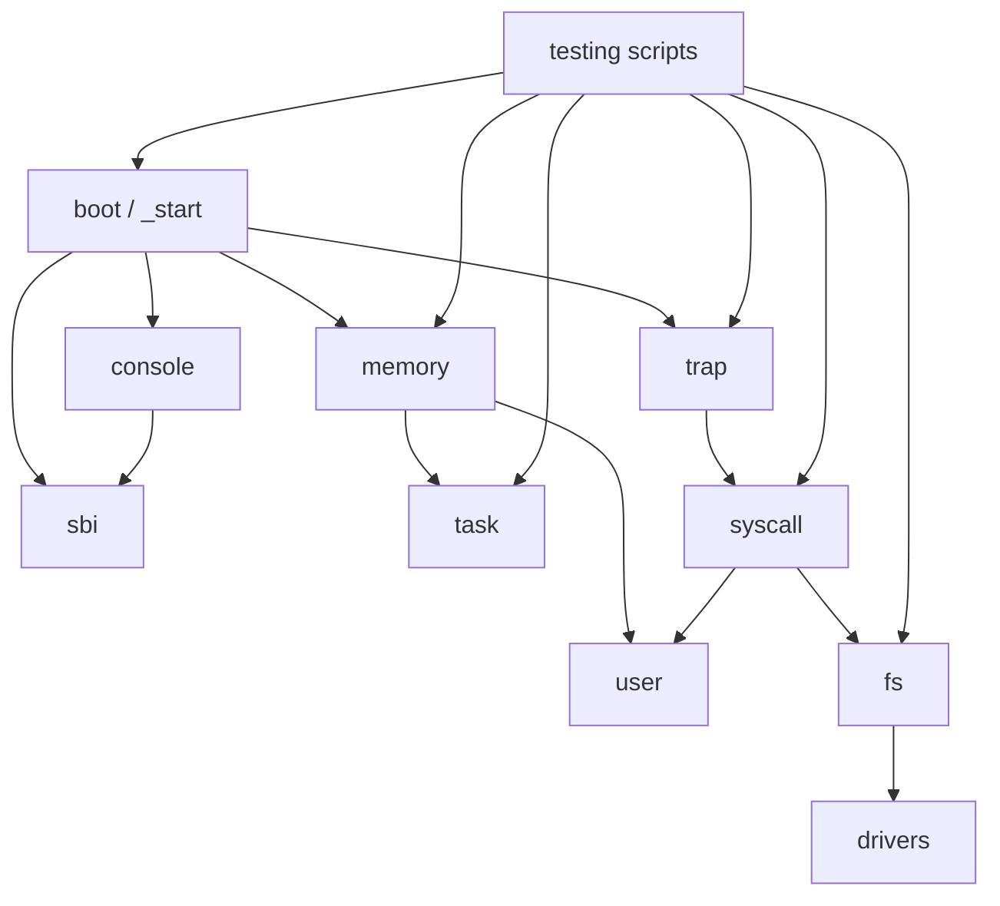
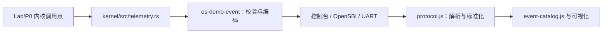

# AI 合作的操作系统教学实验环境设计方案与开发文档

项目名称：AI 合作的操作系统教学实验环境

比赛名称：2026 年全国大学生计算机系统能力大赛 - 操作系统设计赛 - OS 功能挑战赛道第 20 题

教学实验最终解答分支：`lab7-solution`

## 2026-08-13 集成与发布说明

正式产品状态由最新 `origin/main` 与 `origin/agent-mvp` 的集成结果构成：原有 P0、Lab1–Lab7、遥测可视化、自愿远程反馈和教师本地评分保持兼容，新增 `os-tutor.agent/v1` AI 教学助教。智能体由本地桥接器控制六个白名单工具，通过火山方舟 Agent Plan 的 `ark-code-latest` 生成引导式回答；权限边界由服务端校验，不由模型提示词承担。

项目采用四层数据边界：本地确定性诊断、预测、回放和比较不调用模型；反馈与脱敏运行记录只在主动预览同意后发送到负责人服务；智能体问题和按需取得的受限证据可能发送到方舟，API Key 只在服务端环境变量；教师评分保持本地和人工确认。完整接口、工具限制、首次同意和测试边界见 [docs/teaching-agent.md](docs/teaching-agent.md)。

正式发布入口：远端 `main`；首次集成发布提交为 `18182c1`，后续说明修正以文档所在分支 HEAD 为准。P0、Lab1–Lab7 starter/solution、可视化和教师评分材料已同步到各自既有远端分支，未创建新的远端分支名。

文档用途：本文件作为比赛提交所需的设计方案与开发相关文档，覆盖项目目标、赛题分析、系统架构、开发计划、重要进展、测试情况、问题与解决方案、提交目录说明、比赛收获、非本队来源说明以及 AI 工具使用说明。

## 文档目录

1. [目标描述](#1-目标描述)
2. [比赛题目分析和相关资料调研](#2-比赛题目分析和相关资料调研)
3. [系统框架设计](#3-系统框架设计)
4. [开发计划](#4-开发计划)
5. [比赛过程中的重要进展](#5-比赛过程中的重要进展)
6. [系统测试情况](#6-系统测试情况)
7. [遇到的主要问题和解决方法](#7-遇到的主要问题和解决方法)
8. [提交仓库目录和文件描述](#8-提交仓库目录和文件描述)
9. [比赛收获](#9-比赛收获)
10. [学生开发工作补充说明](#10-学生开发工作补充说明)

## 1. 目标描述

### 1.1 项目背景

本项目参加 2026 年全国大学生计算机系统能力大赛操作系统设计赛，选题为 OS 功能挑战赛道第 20 题“AI 合作的操作系统教学实验环境”。

题目关注的不是单纯实现一个功能尽可能复杂的操作系统，而是要求参赛队参考较新的操作系统内核教学实验，结合 AI 工具协作，设计一套适合本科生自学、教师教学和比赛验收的操作系统内核教学实验环境。

### 1.2 建设目标

本项目的总体目标是在 Rust、RISC-V 64、QEMU/OpenSBI 环境下，构建一套具备完整教学路径、可重复构建运行、可自动测试、可供教师验收的操作系统实验环境。

具体目标包括：

- 使用 Rust 编写教学内核主体。
- 运行目标为 RISC-V 64。
- 能够在 QEMU `virt` 机器上通过 OpenSBI 启动。
- 提供 P0 最小运行基线。
- 设计并实现 7 个递进式教学实验。
- 每个实验提供 `starter` 与 `solution` 分支。
- 每个实验拆分为约 3 个由易到难的小任务，整体难度保持中等，面向普通本科生。
- 为学生提供任务书、分级提示、测试说明和清晰 TODO。
- 为教师提供参考实现说明和教师指南。
- 提供主机单元测试、QEMU 系统测试和分阶段测试脚本。
- 在文档中记录 AI 协作过程、非本队来源和项目边界。

### 1.3 教学定位

项目面向第一次系统学习操作系统内核实现的本科生。实验内容不默认学生已经掌握复杂内核开发能力，而是从最小启动、控制台输出和异常处理逐步过渡到内存管理、虚拟内存、任务调度、用户态、系统调用和文件系统。

当前版本不是工业级通用 OS，不追求 POSIX 兼容、复杂硬件支持或完整进程模型，而是以“讲清楚核心机制”为优先目标。

### 1.4 最终交付形态

最终交付形态不是单个可执行文件，而是一套 GitLab 仓库化教学环境：

- 学生从 `labN-starter` 分支进入实验。
- 教师从 `labN-solution` 分支查看参考实现和验收说明。
- 评委可从 `lab7-solution` 查看最终完整成果。
- 设计方案、测试说明、AI 协作记录、提交清单和演示脚本均位于 `docs/`。
- 每个实验都提供可重复运行的 PowerShell 测试脚本。

## 2. 比赛题目分析和相关资料调研

### 2.1 赛题要求分析

根据题目说明和评分要求，本项目需要重点满足以下要求：

| 赛题要求 | 本项目对应实现 |
|---|---|
| 操作系统内核语言为 Rust | `kernel` crate 使用 Rust `no_std`/`no_main` 编写 |
| 目标架构为 RISC-V 64 | 使用 `riscv64gc-unknown-none-elf` 目标 |
| QEMU 运行 | 使用 QEMU `virt` + OpenSBI 启动 S-mode 内核 |
| 至少 5 个基础实验 | 实现 Lab1-Lab7 共 7 个正式教学实验 |
| 使用 Rust Crate 组织 | 使用 Rust workspace 和 `kernel` crate，内部按模块组织 |
| 单元测试或系统测试 | 提供主机单元测试和 QEMU 系统测试 |
| 文档使用 Markdown | `README.md`、`docs/` 和各实验文档均为 Markdown |
| 图示优先使用 Mermaid | 架构图、实验路线图使用 Mermaid |
| AI 合作说明 | 在 `docs/ai-collaboration.md` 和本文档中说明 AI 工具使用 |
| 设计方案文档 | 本文件覆盖设计思路、实现描述、测试、问题、来源说明等 |

### 2.2 评分维度理解

根据截图和题目要求，设计方案等开发相关文档占比较高。文档不仅要说明“做了什么”，还要说明“为什么这样做”“如何验证”“哪些内容来自参考资料”“AI 工具如何参与”“项目成员如何推进”。

因此本项目文档重点覆盖：

- 项目研发设计思路。
- 系统架构和实验架构。
- 代码模块说明。
- 测试结果和验证方式。
- 研发过程中遇到的问题与解决方法。
- 非本队来源说明。
- AI 工具使用说明。
- 分支、目录和提交内容说明。

### 2.3 参考资料调研

本项目参考了公开资料的教学组织思想、RISC-V 特权架构知识和操作系统课程内容，但源码主体由本队在比赛仓库中开发完成。

主要公开资料包括：

- 操作系统设计赛官网与比赛说明。
- OSComp 相关 GitHub 资源。
- rCore Tutorial Book、rCore Tutorial Code、rCore Tutorial Guide。
- LearningOS 课程讲义。
- OSTEP 中文版。
- CSAPP 参考资料。
- RISC-V Reader 中文版。
- QEMU、OpenSBI、Rust 工具链公开文档。

完整链接整理见 `docs/references/resources.md`。

### 2.4 非本队来源说明

| 来源 | 类型 | 用途 | 使用方式 |
|---|---|---|---|
| Rust 语言与工具链 | 编程语言/编译器 | 编写和构建内核 | 使用公开工具链，无源码复制 |
| QEMU | 模拟器 | 模拟 RISC-V `virt` 机器 | 作为运行环境使用 |
| OpenSBI | 固件/SBI 实现 | 从 M-mode 进入 S-mode，提供 console/reset | 通过 QEMU `-bios default` 使用 |
| RISC-V 特权架构 | 公开规范 | 指导 trap、CSR、Sv39、`sret` 等实现 | 按规范自行实现 |
| rCore / LearningOS | 教学资料 | 参考实验组织和知识路线 | 参考思想和课程结构，未直接复制代码 |
| OSTEP、CSAPP、RISC-V Reader | 教材 | 辅助理解 OS 与体系结构概念 | 学习参考 |

当前 `kernel` crate 未引入第三方 Rust crate 依赖。若后续补充外部代码片段、截图或文档，应继续在源码文件和设计文档中标明来源、协议、改动和本项目贡献。

## 3. 系统框架设计

### 3.1 总体架构



### 3.2 代码模块

```text
.
├── Cargo.toml                  # Rust workspace
├── kernel/
│   ├── Cargo.toml              # ai-os-kernel crate
│   ├── linker.ld               # RISC-V 内核链接脚本
│   └── src/
│       ├── boot.rs             # 启动入口和启动栈
│       ├── console.rs          # 控制台输出
│       ├── sbi.rs              # SBI 调用封装
│       ├── trap.rs             # trap / syscall 入口
│       ├── memory/             # Lab3/Lab4 内存管理
│       ├── task/               # Lab5 协作式调度
│       ├── user.rs             # Lab6/Lab7 用户程序
│       ├── syscall.rs          # 系统调用 ABI
│       ├── drivers/            # Lab7 RAM 设备
│       └── fs/                 # Lab7 简化文件系统
├── scripts/                    # 环境检查与 QEMU 测试脚本
├── docs/                       # 设计、测试、实验和提交文档
└── README.md                   # 当前分支入口说明
```

### 3.3 启动与 SBI 控制台

启动代码位于 `kernel/src/boot.rs`，链接脚本位于 `kernel/linker.ld`。QEMU/OpenSBI 从 `0x80200000` 进入内核，启动汇编设置内核栈后跳转到 Rust `kernel_main`。控制台输出通过 SBI console 调用完成，避免裸机环境依赖标准库输出。

### 3.4 Trap 与异常

`kernel/src/trap.rs` 负责设置 `stvec`，保存必要寄存器，读取 `scause`、`sepc`、`stval` 并分发异常。Lab2 使用 breakpoint 异常作为教学入口，处理后推进 `sepc += 4`，防止重复执行同一条 `ebreak`。

### 3.5 物理内存与 Sv39 虚拟内存

Lab3 在 `kernel/src/memory/address.rs` 和 `frame_allocator.rs` 中实现物理地址、物理页号和 frame allocator。分配起点基于链接脚本 `ekernel`，避免覆盖内核镜像、`.bss` 和启动栈。

Lab4 在 `virtual_address.rs` 和 `page_table.rs` 中实现 Sv39 虚拟地址、三级 VPN 索引、PTE flags、页表创建、映射、取消映射和地址翻译。第一版采用恒等映射，便于本科生理解虚拟地址和物理地址关系。权限按段区分：

- `.text`：只读、可执行。
- `.rodata`：只读。
- `.data/.bss/stack`：可读、可写。
- 用户代码：用户态、只读、可执行。
- 用户栈：用户态、可读、可写。

### 3.6 任务调度

Lab5 在 `kernel/src/task/` 中实现单核、内核态、协作式轮转调度。`switch.S` 中的 `__switch` 只保存 `ra`、`sp`、`s0..s11`，符合 RISC-V 调用约定中 callee-saved 寄存器的教学需求。实验不实现抢占、多核、优先级和浮点/向量上下文。

### 3.7 用户态与系统调用

Lab6 在 `kernel/src/user.rs` 中构造内置用户程序和用户栈，在 `kernel/src/syscall.rs` 中定义 syscall ABI，并在 `trap.rs` 中处理用户态 `ecall`。第一版支持最小 `write` 和 `exit`，重点讲清从 U-mode 进入 S-mode 的路径。

### 3.8 设备与简化文件系统

Lab7 在 `kernel/src/drivers/mod.rs` 中实现 RAM 字节设备，在 `kernel/src/fs/mod.rs` 中实现教学版 `SimpleFs`、fd 表、文件偏移和 `open/read/write/close`。用户程序通过系统调用完成文件 I/O 闭环。

### 3.9 核心代码说明

| 代码位置 | 主要职责 | 对应实验 | 教学说明 |
|---|---|---|---|
| `kernel/src/boot.rs` | `_start`、启动栈、进入 Rust | Lab1 | 帮助学生理解裸机程序没有操作系统加载器 |
| `kernel/src/sbi.rs` | SBI console 和 reset 封装 | Lab1 | 说明裸机输出和关机依赖固件接口 |
| `kernel/src/trap.rs` | trap 入口、异常处理、用户态 `ecall` | Lab2、Lab6、Lab7 | 贯穿异常和系统调用两类控制流 |
| `kernel/src/memory/address.rs` | 物理地址、物理页号和对齐 | Lab3 | 让学生掌握页大小、floor/ceil 和 offset |
| `kernel/src/memory/frame_allocator.rs` | 物理页分配和释放 | Lab3 | 说明内核如何管理可用物理页 |
| `kernel/src/memory/page_table.rs` | Sv39 页表、PTE、map/translate | Lab4 | 解释三级页表和权限位 |
| `kernel/src/task/mod.rs` | TCB、状态机、轮转调度 | Lab5 | 说明任务状态和协作式调度 |
| `kernel/src/task/switch.S` | `__switch` 汇编上下文切换 | Lab5 | 说明 callee-saved 寄存器保存 |
| `kernel/src/user.rs` | 内置用户程序、用户栈、U-mode 进入 | Lab6、Lab7 | 展示从内核进入用户态的最小路径 |
| `kernel/src/syscall.rs` | syscall id、参数和返回结果 | Lab6、Lab7 | 说明 ABI 和内核服务分发 |
| `kernel/src/drivers/mod.rs` | RAM 字节设备 | Lab7 | 用最小设备抽象解释文件系统底层 |
| `kernel/src/fs/mod.rs` | SimpleFs、fd 表、文件偏移 | Lab7 | 建立文件描述符与设备读写之间的联系 |

## 4. 开发计划

项目采用 P0 到 Lab7 的递进式计划：

| 阶段 | 目标 | 完成标准 |
|---|---|---|
| P0 | 建立最小 Rust/RISC-V/QEMU 基线 | `[P0] PASS` |
| Lab1 | 启动与 SBI 控制台 | `[Lab1] PASS` |
| Lab2 | Trap 与异常处理 | `[Lab2] PASS` |
| Lab3 | 物理内存管理 | `[Lab3] PASS` |
| Lab4 | Sv39 虚拟内存 | `[Lab4] PASS` |
| Lab5 | 协作式调度 | `[Lab5] PASS` |
| Lab6 | 用户态与系统调用 | `[Lab6] PASS` |
| Lab7 | 设备与简化文件系统 | `[Lab7] PASS` |
| 文档收尾 | 教学化 README、任务书、提示、教师指南、最终报告 | 各分支文档完整 |

开发原则：

- 每次只推进一个明确阶段。
- 先建立可运行基线，再逐步引入实验功能。
- 每个实验先做 starter，再做 solution。
- 每个实验保持约 3 个基础任务。
- 每个实验都提供分阶段测试。
- 不为了功能丰富而增加超出本科教学难度的复杂内容。

分支推进方式：


## 5. 比赛过程中的重要进展

### 5.1 P0 基线建立

最初仓库只有初始化 README。项目先建立 Rust workspace、`kernel` crate、RISC-V 目标配置、链接脚本、启动入口、SBI 输出和 QEMU 测试脚本，使内核能够在 QEMU 中启动并输出稳定成功标志。

### 5.2 Lab1-Lab4 内核基础能力

Lab1 到 Lab4 逐步实现启动、控制台、异常、物理内存和虚拟内存：

- Lab1 完成启动日志和 SBI 控制台。
- Lab2 完成 breakpoint trap 和 `sepc` 推进。
- Lab3 完成物理页分配和释放。
- Lab4 完成 Sv39 页表、恒等映射、`satp` 和 `sfence.vma`。

### 5.3 Lab5-Lab7 操作系统机制闭环

Lab5 到 Lab7 将内核能力扩展到任务、用户态、系统调用和文件 I/O：

- Lab5 实现单核内核态协作式调度。
- Lab6 实现最小 U-mode 用户程序和 `write/exit`。
- Lab7 实现 RAM 设备、SimpleFs 和 `open/read/write/close`。

### 5.4 教学化改造

在功能完成后，项目进一步发现仅有代码和单页说明还不足以作为教学环境。因此将 Lab1-Lab7 全部改造成教学分支：

- starter 根 README 改为学生入口。
- solution 根 README 改为教师入口。
- 每个实验补充 `TASKS.md`、`HINTS.md`、`TESTING.md`。
- solution 分支额外补充 `SOLUTION.md` 和 `TEACHER_GUIDE.md`。
- 测试脚本支持 `-Stage 1/2/3` 和 `-ExpectIncomplete`。

### 5.5 GitLab 提交与高峰期问题

最终阶段遇到 GitLab 响应慢、502/504、pre-receive hook 报错等问题。处理方式是逐个分支普通推送，不使用 force push，并通过 `git ls-remote` 核验远端提交。

## 6. 系统测试情况

### 6.1 测试分层

项目测试分为三层：

1. 格式、构建和静态检查。
2. 主机单元测试。
3. QEMU 系统测试。

测试环境说明：

- 本地主要使用 Windows PowerShell 执行测试脚本。
- Rust target 为 `riscv64gc-unknown-none-elf`。
- QEMU 命令使用 `qemu-system-riscv64 -machine virt -nographic -bios default -kernel ...`。
- OpenSBI 由 QEMU `-bios default` 提供。
- 主机单元测试使用 `x86_64-pc-windows-msvc` target，避免在主机测试中解引用 RISC-V 物理地址。

### 6.2 代表性测试命令

```powershell
cargo fmt --all -- --check
cargo build -p ai-os-kernel
cargo clippy -p ai-os-kernel -- -D warnings
cargo test -p ai-os-kernel --lib --target x86_64-pc-windows-msvc
powershell -NoProfile -ExecutionPolicy Bypass -File scripts/test-lab7.ps1
```

### 6.3 最近一次 Lab7 Solution 验收结果

在 `lab7-solution` 分支最近一次本地验收中：

- `cargo fmt --all -- --check` 通过。
- `cargo build -p ai-os-kernel` 通过。
- `cargo clippy -p ai-os-kernel -- -D warnings` 通过。
- 主机单元测试结果以本轮最终验收报告中的实际命令为准，不沿用历史数字。
- `scripts/test-lab7.ps1 -Stage 1` 通过。
- `scripts/test-lab7.ps1 -Stage 2` 通过。
- `scripts/test-lab7.ps1 -Stage 3` 通过。
- 默认 `scripts/test-lab7.ps1` 通过。

QEMU 关键输出包含：

```text
[Lab1] PASS
[Lab2] PASS
[Lab3] PASS
[Lab4] PASS
[Lab5] PASS
[Lab6] PASS
[Lab7-T1] PASS
[Lab7-T2] PASS
[Lab7] file opened
[Lab7] write/read verified
[Lab7] PASS
```

### 6.4 Starter 测试策略

starter 分支不应输出最终 `[LabN] PASS`，否则会泄露答案。为此测试脚本增加 `-ExpectIncomplete` 模式，要求：

- 工程能够构建。
- QEMU 能启动并正常退出。
- 能看到当前实验 TODO marker。
- 不能看到当前实验最终 PASS。

### 6.5 分阶段测试说明

从教学化改造后，每个实验脚本逐步支持阶段测试，例如：

```powershell
powershell -NoProfile -ExecutionPolicy Bypass -File scripts/test-lab7.ps1 -Stage 1
powershell -NoProfile -ExecutionPolicy Bypass -File scripts/test-lab7.ps1 -Stage 2
powershell -NoProfile -ExecutionPolicy Bypass -File scripts/test-lab7.ps1 -Stage 3
```

这种设计让学生完成每个小任务后都能看到明确结果，而不必等到整个实验全部完成才知道是否正确。

## 7. 遇到的主要问题和解决方法

| 问题 | 影响 | 解决方法 |
|---|---|---|
| QEMU/RISC-V 工具链路径不稳定 | 无法编译或启动 QEMU | 增加环境检查脚本，明确检查 rustc、cargo、rustup、target 和 QEMU |
| starter 缺少 PASS 导致测试失败 | starter CI 会显示失败 | 设计 `-ExpectIncomplete` 模式，验证 starter 未完成但可运行 |
| 页表页所有权管理复杂 | 没有堆分配器时容易丢失页表页 | 使用固定容量页表页所有权结构 |
| 启用分页后容易卡死 | 映射不完整会导致 QEMU 异常 | 采用恒等映射，并按链接脚本符号分别映射各段 |
| 协作式调度容易扩展过度 | 抢占、多核、优先级会显著增加难度 | Lab5 限定为单 hart、内核态、协作式轮转 |
| 用户态实验容易变成完整进程系统 | ELF、多进程、复杂用户指针会超出教学目标 | Lab6 使用内置用户程序，只实现最小 syscall 路径 |
| 文件系统容易变成真实磁盘系统 | virtio-block 和路径解析会显著增加复杂度 | Lab7 使用 RAM 设备和单文件 SimpleFs |
| 根 README 过于笼统 | 学生进入分支后不知道如何开始 | 将每个分支 README 改为当前实验入口 |
| GitLab 高峰期 502/504 | 推送不稳定 | 慢速逐分支推送，并用远端 head 核验 |

补充说明：

- 对于技术性问题，优先通过最小可复现测试定位，例如主机单元测试覆盖纯算法，QEMU 测试覆盖硬件相关路径。
- 对于教学性问题，优先从学生视角检查“切换到 starter 后是否能只看 README 开始实验”。
- 对于提交性问题，优先保证不强推、不覆盖历史、不提交隐私信息。

## 8. 提交仓库目录和文件描述

### 8.1 分支组织

```text
p0-minimal-qemu-baseline
lab1-starter      lab1-solution
lab2-starter      lab2-solution
lab3-starter      lab3-solution
lab4-starter      lab4-solution
lab5-starter      lab5-solution
lab6-starter      lab6-solution
lab7-starter      lab7-solution
main
```

分支含义：

- `p0-minimal-qemu-baseline`：P0 工程基线。
- `labN-starter`：学生起点，不包含完整答案。
- `labN-solution`：教师参考实现。
- `lab7-solution`：当前最终完整成果分支。
- `main`：默认集成展示入口，包含最新文档、可视化遥测与展示材料；Lab7 教学参考实现以 `lab7-solution` 为准。

### 8.2 主要目录

| 路径 | 内容 |
|---|---|
| `README.md` | 当前分支入口说明 |
| `Cargo.toml` | Rust workspace 配置 |
| `kernel/` | RISC-V 教学内核源码 |
| `kernel/linker.ld` | 内核链接脚本 |
| `scripts/` | 环境检查、运行和测试脚本 |
| `docs/` | 需求、架构、测试、AI 协作、实验、最终报告 |
| `docs/labs/` | Lab1-Lab7 教学文档 |
| `docs/references/` | 官方资料和公开资源整理 |

### 8.3 关键文档

| 文件 | 说明 |
|---|---|
| `docs/final-report.md` | 本设计方案与开发文档 |
| `docs/requirements.md` | 赛题要求映射 |
| `docs/architecture.md` | 系统架构 |
| `docs/testing.md` | 测试设计 |
| `docs/ai-collaboration.md` | AI 协作记录 |
| `docs/submission-checklist.md` | 提交检查清单 |
| `docs/demo-script.md` | 演示视频和答辩讲解脚本 |

### 8.4 实验文档

每个实验分支包含对应实验目录：

```text
docs/labs/labN/
├── README.md
├── TASKS.md
├── HINTS.md
├── TESTING.md
├── SOLUTION.md          # 仅 solution 分支
└── TEACHER_GUIDE.md     # 仅 solution 分支
```

### 8.5 评委查阅建议

建议评委按以下顺序查看：

1. `README.md`：了解当前分支和快速入口。
2. `docs/final-report.md`：阅读完整设计方案与开发文档。
3. `docs/requirements.md`：查看赛题要求映射。
4. `docs/testing.md`：查看测试设计和验收命令。
5. `docs/ai-collaboration.md`：查看 AI 协作说明。
6. `docs/labs/README.md`：查看实验路线。
7. `labN-starter` / `labN-solution`：查看某个实验的学生起点和教师参考实现。

如只想快速验收最终成果，可切换到 `lab7-solution` 并运行：

```powershell
cargo fmt --all -- --check
cargo build -p ai-os-kernel
cargo clippy -p ai-os-kernel -- -D warnings
cargo test -p ai-os-kernel --lib --target x86_64-pc-windows-msvc
powershell -NoProfile -ExecutionPolicy Bypass -File scripts/test-lab7.ps1
```

## 9. 比赛收获

### 9.1 技术收获

通过本项目，团队系统实践了：

- Rust 裸机内核开发。
- RISC-V 64 启动、trap、CSR 和 Sv39 页表。
- QEMU/OpenSBI 调试与自动化测试。
- 物理内存管理、虚拟内存、任务调度、用户态和系统调用。
- 教学版设备抽象与文件系统。

### 9.2 工程收获

项目开发过程中形成了较完整的工程习惯：

- 先建立 P0 基线，再逐步推进实验。
- 每次只完成一个明确阶段。
- 修改后执行格式化、构建、Clippy、单元测试和 QEMU 测试。
- 使用 Git 分支组织 starter 和 solution。
- 通过文档和测试保证项目可复现。

### 9.3 教学设计收获

项目从“能运行的代码”进一步转向“能直接用于教学的实验环境”。后期对 Lab1-Lab7 进行了教学化改造，让每个实验都有：

- 清晰的学生入口。
- 三个递进任务。
- 分级提示。
- 分阶段测试。
- 教师参考实现说明。
- 教师验收指南。

这使项目更符合题目“操作系统教学实验环境”的定位。

### 9.4 当前比赛结果

截至本文档生成时，比赛最终获奖结果尚未公布，获奖情况待比赛结束后由项目成员补充。

### 9.5 后续改进方向

后续可以继续扩展：

- 高地址内核映射。
- 计时器中断和抢占式调度。
- ELF 用户程序加载。
- 多进程地址空间。
- 更完整的用户指针检查。
- virtio-block 和真实文件系统。
- 统一 `scripts/test-lab.ps1 all` 测试入口。

这些内容适合作为课程进阶实验或后续比赛扩展。

## 10. 学生开发工作补充说明

### 10.1 补充工作的目标

在已有 P0 和 Lab1-Lab7 教学实验的基础上，我们以学生使用实验仓库的实际过程为出发点，补充完成了“OS实验可视化展示”。这项工作的目标不是另外制作一个脱离代码的动画，而是把实验分支、内核运行过程、串口输出和操作系统知识框架连接起来，使同学在切换分支、构建内核和运行 QEMU 时，能够同步看到当前实验在完整学习路线中的位置。

### 10.2 知识框架的组织方式

可视化页面将实验知识按三种互相补充的视角组织：

- 按实验阶段观察从最小启动、Trap、物理内存、虚拟内存、任务调度、用户态与系统调用到设备和文件系统的递进关系。
- 按内核运行控制流观察启动、异常进入、地址转换、任务切换、特权级转换和文件读写之间的调用关系。
- 按系统资源和状态观察页帧、页表、任务状态、寄存器现场、文件描述符和设备数据如何随实验执行发生变化。

这些视角共享同一组实验节点和运行证据。同学既可以沿 Lab 顺序学习，也可以从控制流、特权级或资源状态等不同维度理解同一个知识点。

### 10.3 动态跟踪与可视化实现

我们为静态 HTML 页面补充了本地桥接服务。桥接服务会识别当前 Git 分支，读取当前实验上下文，并将构建结果和 QEMU/OpenSBI 串口输出转换为页面能够理解的实时事件。页面通过 WebSocket 接收事件后，会同步更新知识节点状态、运行时间线、关键证据和当前实验说明。

桥接服务使用 `os-demo.event/v1` 事件协议统一显式教学标记、稳定串口标志和运行生命周期事件，并为事件补充运行编号、分支、提交编号、顺序和时间。分支映射覆盖 `main`、可视化分支、P0 以及 Lab1-Lab7 的 starter/solution 共 17 个现有分支；Linux 启动脚本还会检查 Node.js、Git、Rust 目标和 QEMU，使页面显示的运行状态与实际实验环境保持一致。

### 10.4 双层教学评价与教师评分

可视化页面内的实验教学评价收集学习者对讲解、任务、提示、可视化和运行反馈的主观感受。题目会随 P0、Lab 和 starter/solution 变化，只保存在当前浏览器或由使用者主动导出、确认提交；它不计算成绩或排名。

`main` 另外提供纯本地教师评分工具。七套 100 分量表来自各实验教师指南，支持多学生本机记录、人工检查、口试、导出和打印。工具可以导入可视化产生的 `os-demo.run/v1`，但只建议 build/QEMU 客观状态，不读取完整日志、不执行学生代码、不自动增加分数。最终成绩必须由教师结合代码审查、实验说明和口试确认。

教学反馈可在使用者主动同意后提交到负责人配置的 HTTPS 服务并写入本机 JSONL；教师评分页面仍不依赖服务器、数据库或 AI 自动评分。导出内容可能包含姓名、提交标识、成绩和自由文本，公开分享前必须由教师人工匿名化和脱敏。

当同学从一个 `labN-starter` 或 `labN-solution` 分支切换到另一个实验分支时，页面会自动重新定位到对应 Lab。starter 分支中的 TODO 只显示为“停在 TODO”，不会被误判为完成；solution 分支运行时产生的稳定标志会逐步点亮相应知识节点。这样，页面展示的不是预设结论，而是当前分支真实运行结果形成的动态反馈。

为了让观察过程形成完整学习闭环，学生必须先保存对运行结果和关键事件的预测，才能启动当前分支。运行结束后可以把完整结构化事件时间线保存在当前浏览器中，按上一步、下一步逐项回放；同一 Lab 的 starter 与 solution 各保存一次后，页面会列出共同事件和两侧独有事件，帮助学生从真实证据理解 TODO 与参考实现之间的差异。

### 10.4 学生使用流程

Ubuntu/Linux 中，同学可以先运行 `sh scripts/run-interactive-demo.sh --check-only` 检查依赖，再切换到需要学习的实验分支并运行 `sh scripts/run-interactive-demo.sh`。浏览器打开页面后，先填写预测，再触发构建与 QEMU 执行，并结合实时串口证据、回放和分支对比理解代码行为。Windows PowerShell 脚本只作为兼容入口。由于 P0 和 Lab1-Lab7 的 starter/solution 分支都包含同一版本的页面与桥接器，因此每个实验分支都能独立启动展示。

### 10.5 验证情况

自动测试现已覆盖教学评价、远程接收、管理页、运行记录、本地桥接、智能体循环、六个工具、模型错误、上下文变化、学生端同意和纯文本渲染。所有数量与通过状态只引用本轮最终验收报告，历史数字不再作为当前证据。

### 10.6 运行事件与知识框架联动

为了让时间线不只回答“发生了什么”，我们补充了独立事件知识目录，以 `lab + step` 作为稳定查找键。目录在保持 `os-demo.event/v1` 字段含义不变的前提下，为已登记事件补充事件名称、OS 知识点、仓库内代码文件、函数或符号、发生原因、状态变化和可能的后续事件。源码定位采用相对文件路径和符号名，不绑定容易变化的绝对行号。

学生点击实时事件或保存后的回放事件时，页面使用同一个目录解析函数生成解释，并同步高亮执行链中的对应知识节点。这样可以从一条 QEMU 运行证据继续追踪到代码入口、机制含义、状态变化和下一步控制流。Lab1-Lab7 的重点链路分别覆盖 SBI 控制台、Trap、物理页帧、Sv39 页表、任务调度、用户态系统调用和文件 I/O；没有真实事件证据时，页面不会补画或伪造运行步骤。

安全边界也在目录层统一处理。只有经过检查的仓库相对路径才能生成源码链接，绝对路径、父目录跳转和网络共享路径会被拒绝。未登记或旧格式事件保留经过长度限制的原始信息，显示降级提示，但不推进知识地图，也不会造成页面异常。事件解释、回放和分支映射模块本身在本机完成；可选智能体和自愿反馈使用各自独立、需明确同意的远程链路。Node 测试验证事件映射、降级、源码路径边界、分支上下文和实时/回放解释一致。

本次集成后的 Node 测试数量和结果见最终验收报告。事件解释只接受明确的 `os-demo.event/v1` 证据；保存记录会深度校验并重新计算预测对照，双方均无证据的状态也会单独列为“双方证据不足”，避免把未知误写成一致。

### 10.7 运行记录交换

为了让一次真实实验过程能够在不同电脑之间复核，我们增加了独立的 `run-transfer.js`，使用 `os-demo.run/v1` 作为运行记录交换格式。JSON 记录保存分支、提交、实验角色、起止时间、学生预测、`os-demo.event/v1` 事件、最终结果和预测对照；Markdown 则面向课堂讨论和实验总结，按相同证据生成可读报告。

导入过程完全在浏览器本地完成，不调用上传接口、不执行文件内容，也不自动切换 Git 分支。文件进入运行历史前必须通过版本、协议、大小、事件数量和字段检查，并清除本地用户名、访问令牌、危险 HTML 与控制字符。重复运行 ID 由使用者选择覆盖或生成新 ID；通过检查的记录继续复用原有回放和 starter/solution 比较模块，导入文件自带的结论不会替代页面根据真实结构化事件重新计算的结果。

### 10.8 运行时间线交互与完整前缀回放

为了在事件较多时仍能定位关键过程，我们增加了独立的 `timeline-controller.js`。它只读取经过保存的事件数组，不增加或修改 `os-demo.event/v1` 字段，并把按状态、来源、Lab、步骤和关键词得到的结果表示为原始事件索引列表。筛选仅影响页面展示和导航，不会排序、删除或写回原始事件，也不会改变导入导出的运行记录。

回放到任意原始索引时，页面从第一条事件开始重放到当前位置，用完整事件前缀重建知识节点、动态结构和教学状态。因此被筛选隐藏的事件仍参与状态计算，不会因为只显示 PASS、某个来源或某个步骤而丢失前置机制。相邻耗时也固定使用原始序列中的前一事件；总时长、原始事件数、当前显示数和中断状态分别展示，证据不足时不补造时间或失败事件。

播放器支持播放、暂停、0.5/1/2/4 倍速、上一步、下一步、首个失败事件和首个 starter/solution 差异跳转。差异比较先把 Lab 事件映射回完整运行记录中的原始索引，再按当前回放侧选择最早可定位的差异，避免继承事件或单侧事件造成跳转偏移。键盘操作提供空格、方向键、Home/End、F、D、`/` 和 Esc，并避开普通表单输入。

新增 Node 内置测试覆盖空时间线、512 个事件、五类筛选、快速连续操作、播放中切换筛选、完整前缀状态、四档速度、相邻耗时、运行中断、首次失败与首次差异，以及刷新后从 localStorage 载入并得到一致回放状态。播放器计时器与知识地图自动讲解计时器相互独立；载入或导入新记录、开始真实运行、检测分支变化和页面离开时都会停止旧播放器，避免过期回调继续推进。

### 10.9 本地确定性规则诊断

为了提供可重复的基础判断，我们保留独立的 `diagnostics.js`。该模块只在本地读取当前 Lab、分支角色、构建结果、`os-demo.event/v1` 结构化事件、经过净化和长度限制的稳定输出以及最终运行状态，不调用模型或外部服务，也不改变现有事件协议。AI 教学助教位于其后，作为必须明确同意的可选云端引导层。

诊断规则覆盖 Cargo 构建失败、缺少 RISC-V target、QEMU 不存在、starter TODO、QEMU 超时，以及 Lab2-Lab7 的 Trap、`sepc`、`satp`、页帧、任务切换、用户态系统调用和文件 I/O 关键故障现象。每条结果保留触发证据、可能原因、建议检查的代码文件或函数、对应实验文档和确定性标志。其中“能确定”只表示触发现象有直接证据，根因始终以可能原因表述；starter 按设计停在 TODO 是正常教学边界，不显示为错误。

运行历史最多保存 60 条净化后的稳定输出，不保存完整终端日志，也不持久化诊断结论。实时运行、导入记录和历史回放在加载时使用当前规则重新计算，避免旧结论覆盖新规则。`diagnostics.test.js` 同时检查正向规则和误报边界，重点保证单次 Trap、正常 `satp` 后续、正确任务切换、合法系统调用、完整文件读写及 starter TODO 不会被错误报告。

### 10.10 课堂与答辩演示模式

为方便投影讲解，我们在普通页面之外增加了可由页面按钮或 `?mode=presentation` URL 参数进入的演示模式，并为 Lab1、Lab2、Lab4、Lab5 提供推荐入口。该模式只重新组织展示层：放大知识地图、时间线、事件解释、系统状态和 starter/solution 差异，隐藏评价表、开发调试信息和次要控制，同时保留全屏、本地运行记录导入、完整事件前缀回放及键盘操作。响应式样式仅在演示模式下生效，不改变普通模式布局。

演示模式的安全边界与实验模式保持一致。Ubuntu/Linux 使用 `sh scripts/run-interactive-demo.sh` 启动 8888 端口，演示时不添加 `--run`；页面不会因进入演示模式或选择推荐 Lab 而自动运行 QEMU、切换 Git 分支或上传代码和运行证据。演示专用 session 只记录本次会话的视图位置，一键重置不会删除已有运行记录、学生预测和教学反馈，真实运行仍必须由使用者明确确认。

### 10.11 教学评价异地提交闭环

现有 `schemaVersion: 2` 评价记录、五道分支针对性题目和草稿键保持不变，只在提交时增加 `os-demo.feedback.submit/v1` 传输封装。浏览器将反馈服务地址和可选邀请码分别保存在本机；邀请码只进入 `X-Feedback-Invite` 请求头，不进入评价记录和导出文件。首次点击时生成的 `feedback.id` 会随待提交记录保存在原草稿中，网络失败、刷新和再次点击都复用同一 ID。


8890 只提供健康检查、CORS 预检、评价提交和自愿运行记录提交接口。评价请求限制为 32 KiB，按明确来源白名单处理 CORS，重新验证并净化记录，对同一来源进行每分钟 10 次的简单限流。`feedback.id` 是幂等键：新 ID 追加一行 JSON；相同 ID 和内容返回原回执；相同 ID 但内容不同返回 409，绝不覆盖原记录。写入失败不会返回成功。端口不提供管理页面。

8891 只绑定 `127.0.0.1` 并拒绝外部 Host，读取本机评价与运行记录 JSONL，分别提供筛选、汇总和 JSON/CSV/Markdown 导出。浏览器渲染全部记录时只使用 `textContent`，服务端同时设置本机资源 CSP。课堂异地测试只把 8890 放入临时 HTTPS 隧道，8888、8891、SSH 和 Git 均不公开。

这一闭环只传输经过净化的教学评价，不传输实验代码、完整终端日志、QEMU 输出、浏览器 Cookie、邀请码或访问令牌，也不打开 GitLab Issue、调用邮箱、AI 或外部数据库。网络故障时草稿和离线导出继续可用。当前实现需要项目负责人的 Ubuntu 虚拟机保持在线；Quick Tunnel 地址会变化；邀请码只是课堂级保护；JSONL 与基础查看页只适合小规模演示。后续在人员和设备允许时，可改用固定域名与正式 Tunnel、SQLite、备份恢复、匿名标识和更正式的权限管理。

### 10.12 学生实验运行记录自愿提交

在本机运行历史、导入导出和回放保持不变的基础上，我们增加独立的 `run-submission.js`。学生只能从已经保存的记录中选择一次运行；页面先使用白名单生成脱敏预览，明确列出发送与不发送的字段，再由学生勾选同意并点击按钮。取消选择、页面加载、回放、导入、刷新和关闭都不会调用提交接口。运行记录与教学评价互相独立，只有已经获得评价回执时才可附带一个可选 `feedbackId` 方便项目负责人一起查看，系统不会据此推断提交者身份。

传输封装固定为 `os-demo.run.submit/v1`，其中 `run` 仍是 `os-demo.run/v1`，事件仍是 `os-demo.event/v1`，不改变现有协议字段含义。白名单只保留运行编号、分支、提交、Lab、starter/solution 角色、起止时间、学生预测、最多 512 个结构化事件、最终结果、预测对照和少量生命周期结果；源代码、文件内容、命令行、环境变量、完整终端/串口/stdout/stderr、Cookie、认证头、令牌、密码和绝对用户路径均不会进入提交对象。预测依据、事件说明和错误文字还会再次过滤危险 HTML 与敏感字符串，脱敏后的请求不能超过 512 KiB。

8890 的 `POST /api/run-record` 复用原邀请码、CORS 白名单和限流，只把运行记录追加到独立的 `feedback-data/runs.jsonl`。`runId` 是幂等键：相同内容重试返回原回执，不同内容返回 409，任何写入失败都不会返回成功。反馈记录和运行记录的文件、索引和导出互相分离，8890 仍不提供管理页面。

8891 增加运行记录区域，按 Lab、starter/solution 和最终结果筛选，并显示运行编号、提交短编号、时长、事件数、最终结果、预测对照和可选关联评价。事件展示复用 `event-catalog.js`，只用 `textContent` 生成“事件名称—知识点—状态—时间—相邻耗时”时间线，同时提供 JSON、CSV 摘要和 Markdown 运行总结；不执行记录中的任何内容，不进行成绩、排名或身份推断。

该实现适合学生团队进行小规模课堂验证，但不是监控系统：没有后台上传、批量收集、断点续传、长期账号和高并发数据库。学生每次都必须自行选择和确认；超过事件或大小限制的记录只能保留在本机。未来如有稳定服务器和维护人员，可在继续保留自愿同意、数据最小化与本地管理边界的前提下，再增加备份恢复、SQLite 和正式访问控制。

### 10.13 独立事件协议 Crate

公共事件编码被适度抽取到 `crates/os-demo-event/`，内核中的 Lab 实现仍只调用原有 `telemetry::event(lab, step)` 入口。`kernel/src/telemetry.rs` 将控制台包装为 `core::fmt::Write`，再调用 `os-demo-event` 完成字段校验和串口编码，避免批量修改实验调用点或触碰学生 TODO、solution 答案边界。



Crate 只拥有现有串口事件的公共常量、Lab 标识、事件状态推导和 `[OS_DEMO] lab=<lab> step=<step>` 编码规则，不新增协议字段。浏览器端仍负责把串口事实标准化为 `os-demo.event/v1` 事件，并按原有规则补充 `status`、`detail` 和 `source`；`lab + step` 稳定键及未知事件降级路径没有改变。因此，同一内核调用在抽取前后产生兼容的串口文本，已有运行历史和解析器不需要迁移。

`os-demo-event` 使用 `#![no_std]`，不引入 `alloc`、第三方依赖或不安全代码。所有事件都借用调用者提供的字符串，并写入调用者提供的 `core::fmt::Write`，不访问网络、文件系统、进程或 Shell。长度和字符集在写入前完成校验，非法字段不会产生半条结构化事件；这一边界使 Crate 可以独立进行主机单元测试、生成 API 文档和验证 Cargo 打包，同时不承载任何 Lab 核心实现。
