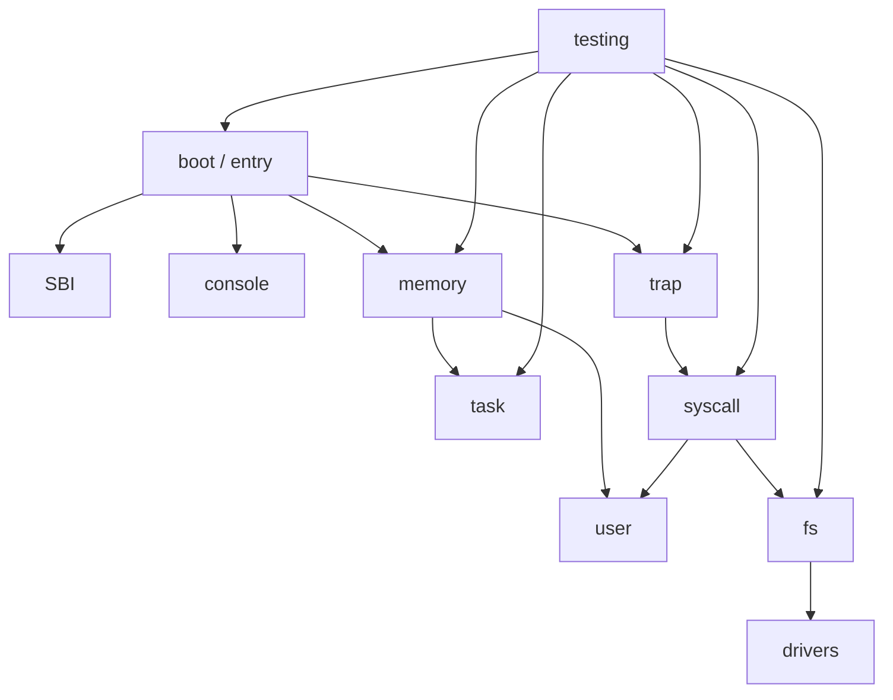

# AI 合作的操作系统教学实验环境最终技术报告

## 项目概述

本项目参加 2026 年全国大学生计算机系统能力大赛操作系统设计赛，OS 功能挑战赛道第 20 题：AI 合作的操作系统教学实验环境。

项目目标是在 Rust、RISC-V 64、QEMU/OpenSBI 环境下构建一套适合本科生学习的操作系统内核教学实验平台。平台采用 P0 工程基线加 7 个递进式实验组织方式，每个正式实验均提供 starter 分支和 solution 分支，便于学生学习、教师讲解和自动验收。

## 设计目标

- 使用 Rust 编写教学内核主体。
- 在 RISC-V 64 架构和 QEMU `virt` 机器上运行。
- 通过 OpenSBI 进入 S-mode 内核。
- 将操作系统核心知识拆分为 7 个中等难度实验。
- 每个实验尽量拆成约 3 个递进小任务，适合普通本科生逐步完成。
- 提供主机单元测试或 QEMU 系统测试。
- 文档使用 Markdown，结构图和流程图优先使用 Mermaid。

## 总体架构



当前实现以 `kernel` crate 为主体。P0 负责可运行基线，Lab1-Lab7 逐步引入启动、异常、内存、虚拟内存、任务、用户态、系统调用、设备和文件系统。

## 实验设计

| 阶段 | 实验名称 | 教学重点 | 分支 |
|---|---|---|---|
| P0 | 最小可运行内核 | 工程基线，不计入正式实验 | `codex/p0-minimal-qemu-baseline` |
| Lab1 | 启动与 SBI 控制台 | OpenSBI、S-mode 入口、控制台输出 | `lab1-starter` / `lab1-solution` |
| Lab2 | Trap 与异常处理 | `stvec`、`scause`、`sepc`、breakpoint | `lab2-starter` / `lab2-solution` |
| Lab3 | 物理内存管理 | 物理地址、页号、frame allocator | `lab3-starter` / `lab3-solution` |
| Lab4 | Sv39 虚拟内存 | 三级页表、PTE、`satp`、`sfence.vma` | `lab4-starter` / `lab4-solution` |
| Lab5 | 协作式调度 | 任务上下文、静态栈、轮转调度 | `lab5-starter` / `lab5-solution` |
| Lab6 | 用户态与系统调用 | U-mode、`ecall`、`write`、`exit` | `lab6-starter` / `lab6-solution` |
| Lab7 | 设备与简化文件系统 | 内存设备、fd 表、`open/read/write/close` | `lab7-starter` / `lab7-solution` |

## 自动测试

本项目使用三层测试：

- 格式、构建和静态检查：`cargo fmt`、`cargo build`、`cargo clippy`。
- 主机单元测试：验证地址计算、页表算法、任务状态机、系统调用分发和内存文件系统。
- QEMU 系统测试：验证真实 RISC-V 启动、trap、分页、任务切换、用户态系统调用和文件 I/O。

核心验收命令：

```powershell
cargo fmt --all -- --check
cargo build -p ai-os-kernel
cargo clippy -p ai-os-kernel -- -D warnings
cargo test -p ai-os-kernel --lib --target x86_64-pc-windows-msvc
powershell -NoProfile -ExecutionPolicy Bypass -File scripts/test-lab7.ps1
```

最终 QEMU 输出包含：

```text
[Lab1] PASS
[Lab2] PASS
[Lab3] PASS
[Lab4] PASS
[Lab5] PASS
[Lab6] PASS
[Lab7] PASS
```

## 创新点

- 使用 AI 协作方式推进需求分析、实验设计、代码实现和测试修复，并在 `docs/ai-collaboration.md` 中记录关键过程。
- 每个实验保留 starter 和 solution 分支，既便于学生练习，也便于教师展示参考实现 diff。
- starter 分支使用 `-ExpectIncomplete` 验证模式，确保学生起点可构建、可启动，但不会泄露答案。
- 实验从 P0 到 Lab7 串成完整 QEMU 验收链，学生每完成一阶段都能看到明确输出。

## 当前限制

- Lab5 不实现抢占式调度、多核调度或复杂优先级策略。
- Lab6 不实现 ELF 加载、多进程和完整用户指针校验。
- Lab7 不实现 virtio-block、真实磁盘、目录树或复杂路径解析。
- 当前文件系统为教学版内存文件系统，适合解释抽象关系，不追求工业级完整性。

这些限制是有意的教学边界，可作为扩展任务或答辩思考题。

## 结论

项目已经完成 P0 工程基线和 Lab1-Lab7 教学实验闭环。当前实现满足 Rust、RISC-V 64、QEMU/OpenSBI、Markdown 文档、Mermaid 图、自动测试和 AI 协作记录等赛题核心要求，可用于后续比赛提交、课堂演示和答辩材料整理。
