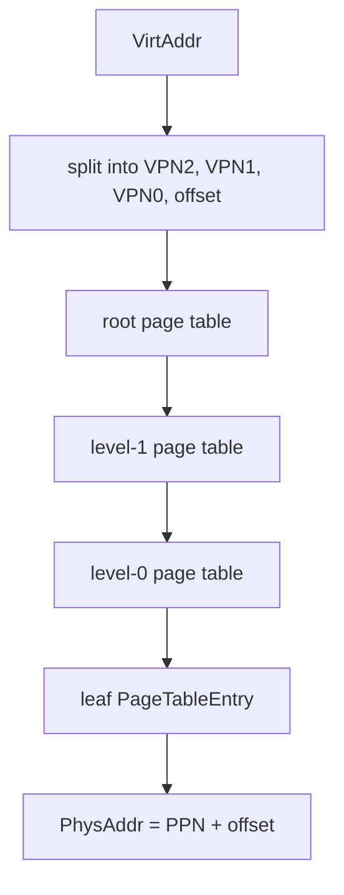

# Lab4: RISC-V Sv39 虚拟内存

## 实验背景

Lab4 在 Lab3 物理页分配器的基础上，引入 RISC-V Sv39 虚拟内存。学生将理解虚拟地址如何经过三级页表翻译到物理地址，并为后续任务管理、用户态和系统调用打基础。

本分支是 `lab4-starter`，只提供教学骨架和 TODO，不启用完整分页，不输出 `[Lab4] PASS`。

## 学习目标

- 理解 Sv39 虚拟地址结构。
- 理解 VPN、PPN 和页内偏移。
- 理解三级页表和页表项格式。
- 理解 PTE 权限位。
- 理解 `satp` 和 `sfence.vma` 的作用。
- 能解释为什么内核启用分页后仍需要继续执行。

## 前置实验

- Lab1：启动、SBI 和控制台。
- Lab2：trap 与异常处理。
- Lab3：物理页分配和释放。

## Sv39 地址结构

Sv39 使用 39 位有效虚拟地址。4 KiB 页大小下，低 12 位是页内偏移，其余部分分成 3 个 9 位 VPN 索引：

```text
| VPN[2] | VPN[1] | VPN[0] | page offset |
|  9bit  |  9bit  |  9bit  |    12bit    |
```

starter 中提供：

- `VirtAddr`
- `VirtPageNum`
- `VirtAddr::floor`
- `VirtAddr::ceil`
- `VirtPageNum::indexes`

这些函数在 starter 中保留 TODO，solution 阶段再补全。

## 三级页表

Sv39 页表有三级，每一级页表页包含 512 个页表项。地址翻译时依次使用：

1. `VPN[2]` 查根页表。
2. `VPN[1]` 查第二级页表。
3. `VPN[0]` 查第三级页表。
4. 叶子 PTE 给出物理页号 PPN，再加页内偏移得到物理地址。



## 页表项格式

Lab4 starter 提供 `PageTableEntry` 和 `PTEFlags`。关键标志包括：

- `V`：有效。
- `R`：可读。
- `W`：可写。
- `X`：可执行。
- `U`：用户可访问。
- `G`：全局映射。
- `A`：已访问。
- `D`：已修改。

starter 中 `PageTableEntry::ppn`、`PageTable::map`、`PageTable::unmap` 和 `PageTable::translate` 保留 TODO。

## satp 寄存器

Sv39 下 `satp` 由以下字段组成：

- MODE：Sv39 为 8。
- ASID：starter 暂不使用，保持 0。
- PPN：根页表物理页号。

starter 提供 `make_satp` 辅助函数，但不会写入 `satp`。

## sfence.vma

未来 solution 在切换地址空间或更新页表后，需要执行 `sfence.vma` 刷新地址翻译缓存。starter 不执行该指令，避免在未建立完整恒等映射前破坏当前执行环境。

## 内核映射策略

未来 solution 优先使用恒等映射，即虚拟地址等于物理地址。这样在启用分页后，当前代码、栈、SBI 调用路径和串口输出仍能继续访问。

starter 只保留设计边界：

- 不真实分配根页表页。
- 不创建中间级页表。
- 不写 `satp`。
- 不启用分页。

## Starter 和 Solution 区别

`lab4-starter`：

- 提供 `VirtAddr`、`VirtPageNum`、`PageTableEntry`、`PTEFlags`、`PageTable`、`MemorySet` 骨架。
- QEMU 输出 `[Lab4] TODO: implement Sv39 page table mapping`。
- 不输出 `[Lab4] PASS`。

未来 `lab4-solution`：

- 补全三级索引、页表项解析、map、unmap、translate。
- 建立内核必要恒等映射。
- 写入 `satp` 并执行 `sfence.vma`。
- 启用分页后继续输出 `[Lab4] PASS`。

## 学生任务

学生需要补全：

- `VirtAddr::floor`
- `VirtAddr::ceil`
- `VirtAddr::page_offset`
- `VirtPageNum::indexes`
- `PageTableEntry::ppn`
- `PageTable::find_pte_create`
- `PageTable::map`
- `PageTable::unmap`
- `PageTable::translate`
- `MemorySet::activate`

## 禁止修改的基础设施

学生不应为了完成 Lab4 修改：

- QEMU 启动参数。
- OpenSBI 调用接口。
- Lab1 控制台路径。
- Lab2 trap 入口。
- Lab3 物理页分配器接口。
- `scripts/test-lab4.ps1` 的 PASS 判定。
- `kernel/linker.ld` 中的内核加载基址。

## 构建和测试命令

构建：

```powershell
cargo build -p ai-os-kernel
```

starter 验收：

```powershell
powershell -NoProfile -ExecutionPolicy Bypass -File scripts/test-lab4.ps1 -ExpectIncomplete
```

回归测试：

```powershell
powershell -NoProfile -ExecutionPolicy Bypass -File scripts/test-lab1.ps1
powershell -NoProfile -ExecutionPolicy Bypass -File scripts/test-lab2.ps1
powershell -NoProfile -ExecutionPolicy Bypass -File scripts/test-lab3.ps1
```

## Starter 预期结果

starter 应输出：

```text
[Lab3] PASS
[Lab4] start
[Lab4] TODO: implement Sv39 page table mapping
```

starter 不应输出：

```text
[Lab4] PASS
```

## Solution 预期输出

未来 solution 完成后，QEMU 输出应包含：

```text
[Lab4] start
[Lab4] PASS
```

## 未来测试设计

主机单元测试应覆盖：

- 虚拟地址 `floor` 和 `ceil`。
- 虚拟地址与虚拟页号转换。
- Sv39 三级索引。
- PTE flags 设置与读取。
- 无效 PTE、叶子 PTE。
- 只读、可写、可执行权限组合。
- `map` 后 `translate`。
- 重复 `map`。
- `unmap` 后 `translate` 失败。
- 未映射地址查询。

QEMU 集成测试应覆盖：

- 分配根页表。
- 建立内核必要映射。
- 激活 `satp`。
- 执行 `sfence.vma`。
- 启用分页后继续输出。
- 映射测试页并读写验证。
- 权限位验证。
- 最终输出 `[Lab4] PASS`。

## 常见错误

- VPN 索引顺序写反。
- PTE 忘记设置 `V` 位。
- 将非叶子 PTE 当成叶子映射。
- 写 `satp` 前没有建立当前代码和栈的恒等映射。
- 写 `satp` 后忘记执行 `sfence.vma`。
- 把 Lab4 扩展成任务、系统调用或文件系统实验。

## 调试方法

- 先在主机测试中验证地址拆分和 PTE flags。
- 手动画出 3 级页表路径。
- 启用分页前确认代码段、只读段、数据段、BSS、栈和 MMIO 都有映射。
- QEMU 输出只匹配稳定 marker，不依赖完整 OpenSBI banner。

## 思考题

1. 为什么 Sv39 每一级索引都是 9 位？
2. 为什么启用分页前必须映射当前正在执行的代码？
3. 只读页和可执行页的权限位应该如何组合？
4. `satp` 切换后为什么需要 `sfence.vma`？
5. Lab4 的页表页为什么依赖 Lab3 的物理页分配器？

## 教师验收方法

在 `lab4-starter` 上运行：

```powershell
powershell -NoProfile -ExecutionPolicy Bypass -File scripts/test-lab4.ps1 -ExpectIncomplete
```

该命令通过说明 starter 可构建、可启动，Lab3 基线仍正常，并且没有提前输出 `[Lab4] PASS`。
