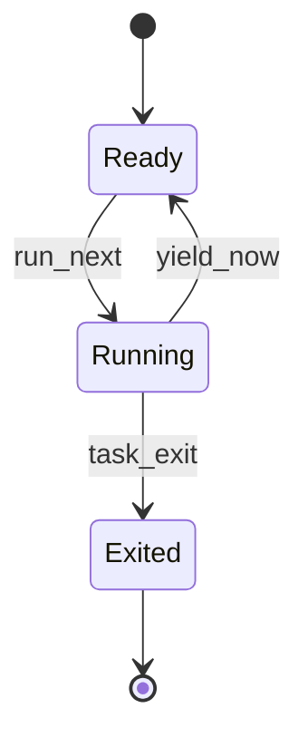
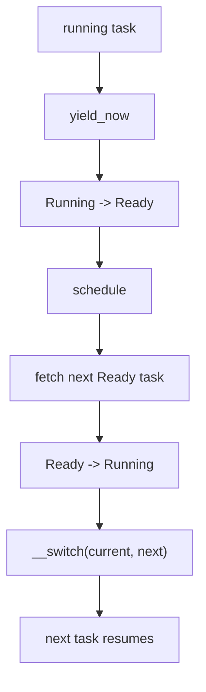

# Lab5：任务管理与协作式调度

## 实验背景

Lab5 在 Lab4 已启用 Sv39 恒等映射的基础上，引入内核态任务和协作式调度。第一版只讨论任务主动 `yield` 让出 CPU 的模型，不引入时钟中断抢占、用户态、系统调用或文件系统。

`lab5-starter` 只建立任务管理骨架和上下文切换边界，不执行真实多任务切换，不输出 `[Lab5] PASS`。

## 学习目标

- 理解内核任务、任务控制块和任务状态。
- 理解任务上下文与 RISC-V 调用约定。
- 理解每个任务为什么需要独立内核栈。
- 理解协作式调度中 `yield`、`schedule` 和 `__switch` 的关系。
- 能够区分 starter 骨架和 solution 参考实现的边界。

## 前置实验

- Lab1：启动、SBI 和控制台。
- Lab2：trap 与异常处理。
- Lab3：物理页分配器。
- Lab4：Sv39 虚拟内存。

## 内核任务模型

Lab5 第一版使用内核线程式任务：

- 所有任务运行在 S-mode 内核态。
- 所有任务共享当前 Lab4 恒等映射地址空间。
- 任务通过主动调用 `yield_now` 让出 CPU。
- 不使用时钟中断抢占。
- 不进入用户态，不实现系统调用。

选择协作式任务，是为了让学生先专注于任务状态、任务栈和上下文切换本身，避免把时钟中断、特权级切换和用户态地址空间同时混入一个实验。

## TaskContext

`TaskContext` 规划保存：

- `ra`
- `sp`
- `s0` 至 `s11`

这些寄存器是 RISC-V 调用约定中的 callee-saved 寄存器。临时寄存器和参数寄存器由调用者保存，因此 `__switch` 不需要保存所有通用寄存器。

Starter 中 `TaskContext::goto` 保留 TODO，占位实现不构造真实可运行任务上下文。

## TaskControlBlock

任务控制块规划包含：

- `TaskId`
- `TaskStatus`
- `TaskContext`
- 任务入口函数
- 任务栈顶地址

Starter 中 TCB 可以被创建和检查，但 `add_task`、`fetch_next`、`run_next` 等关键调度逻辑仍返回明确的 `Unimplemented`。

## 任务状态

Lab5 使用三个状态：

- `Ready`：任务可以被调度。
- `Running`：任务正在占用 CPU。
- `Exited`：任务已经结束。



## 内核栈

Starter 为任务栈建立固定容量设计：

- `MAX_TASKS = 4`
- `TASK_STACK_SIZE = 16 KiB`
- 每个任务使用独立静态栈。
- 栈顶按 16 字节对齐。
- 不复用 boot stack。
- 不引入动态堆分配器。

固定容量耗尽时，solution 应返回明确错误，而不是覆盖已有任务或栈。

## yield 和 schedule 流程



Starter 中该流程只以接口和 TODO 形式存在，不执行真实切换。

## __switch 边界

`__switch(current, next)` 的规划职责：

- 将当前任务的 `ra`、`sp`、`s0..s11` 保存到 `current`。
- 从 `next` 恢复 `ra`、`sp`、`s0..s11`。
- 返回后继续在下一个任务的栈上执行。

安全前提：

- `current` 和 `next` 都指向有效的 `TaskContext`。
- 任务栈顶按 16 字节对齐。
- 调度器已经正确更新任务状态。
- 不在中断抢占路径中调用该接口。

Starter 的 `switch.S` 只提供可链接占位符，不包含完整保存/恢复参考答案。

## Starter 和 Solution 区别

`lab5-starter`：

- 提供 `TaskId`、`TaskStatus`、`TaskContext`、`TaskControlBlock`、`TaskManager` 骨架。
- 提供独立任务栈和 `__switch` 占位符。
- 输出 `[Lab5] start`、`[Lab5] scheduler initialized` 和 TODO marker。
- 不输出 `[Lab5] PASS`。

未来 `lab5-solution`：

- 补全任务上下文初始化。
- 补全任务入队、Ready 扫描和 round-robin 调度。
- 补全 `yield_now`、`schedule` 和真实 `__switch`。
- 验证任务 A/B/C 交替输出并最终输出 `[Lab5] PASS`。

## 学生任务

学生需要补全：

- `TaskContext::goto`
- `TaskManager::add_task`
- `TaskManager::fetch_next`
- `TaskManager::run_next`
- `yield_now`
- `schedule`
- `__switch` 中的上下文保存和恢复

禁止为了完成 Lab5 修改：

- QEMU 启动参数。
- SBI 控制台和关机接口。
- Lab2 trap demo。
- Lab3 物理页分配器接口。
- Lab4 页表和 `[Lab4] PASS` 验收逻辑。

## 构建和测试命令

Starter 验收：

```powershell
powershell -NoProfile -ExecutionPolicy Bypass -File scripts/test-lab5.ps1 -ExpectIncomplete
```

回归测试：

```powershell
cargo fmt --all -- --check
cargo build -p ai-os-kernel
cargo clippy -p ai-os-kernel -- -D warnings
powershell -NoProfile -ExecutionPolicy Bypass -File scripts/test-lab1.ps1
powershell -NoProfile -ExecutionPolicy Bypass -File scripts/test-lab2.ps1
powershell -NoProfile -ExecutionPolicy Bypass -File scripts/test-lab3.ps1
powershell -NoProfile -ExecutionPolicy Bypass -File scripts/test-lab4.ps1
```

## Starter 预期输出

```text
[Lab4] PASS
[Lab5] start
[Lab5] scheduler initialized
[Lab5] TODO: implement cooperative scheduler
```

Starter 不应输出：

```text
[Lab5] PASS
```

## Solution 预期输出

未来 solution 至少应包含稳定交替顺序：

```text
[Lab5] task A step 1
[Lab5] task B step 1
[Lab5] task C step 1
[Lab5] task A step 2
[Lab5] task B step 2
[Lab5] task C step 2
[Lab5] scheduler finished
[Lab5] PASS
```

## 主机单元测试规划

未来 solution 的纯逻辑测试应覆盖：

- 初始任务状态。
- Ready 任务入队。
- 选择下一个 Ready 任务。
- `Running -> Ready`。
- `Running -> Exited`。
- 所有任务结束后的调度结果。
- 固定任务容量耗尽。
- 重复添加任务。
- 非法状态转换。
- round-robin 调度顺序。

宿主机测试不得执行 RISC-V 汇编上下文切换；真实 `__switch` 必须由 QEMU 集成测试验证。

## 常见错误

- 栈顶没有 16 字节对齐。
- `ra` 或 `sp` 没有正确保存恢复。
- 忘记保存 `s0..s11`。
- `yield` 后没有把当前任务转回 `Ready`。
- 任务结束后仍被调度。
- 空任务队列导致死循环。
- Starter 提前输出 `[Lab5] PASS`，泄露 solution 验收条件。

## 调试方法

- 先用主机测试验证任务状态机和调度顺序。
- 再用 QEMU 验证真实上下文切换。
- 每个任务输出稳定 marker，避免依赖完整 OpenSBI banner。
- 如果任务切换后卡死，优先检查 `sp` 对齐、`ra` 设置和 `s0..s11` 保存恢复。

## 抢占式调度扩展

抢占式调度需要时钟中断、trap 路径中的调度入口和更严格的临界区设计。它适合作为后续扩展任务或思考题，不纳入 Lab5 第一版主线验收。

## 思考题

1. 协作式调度和抢占式调度的区别是什么？
2. 为什么 `__switch` 保存 callee-saved 寄存器即可？
3. 如果任务不主动 `yield`，协作式调度会发生什么？
4. 为什么每个任务必须有独立内核栈？
5. 抢占式调度需要额外处理哪些一致性问题？

## 教师验收方法

在 `lab5-starter` 运行：

```powershell
powershell -NoProfile -ExecutionPolicy Bypass -File scripts/test-lab5.ps1 -ExpectIncomplete
```

该命令通过说明内核仍可构建和启动、Lab4 基线仍正常、Lab5 starter marker 存在，并且没有提前输出 `[Lab5] PASS`。
