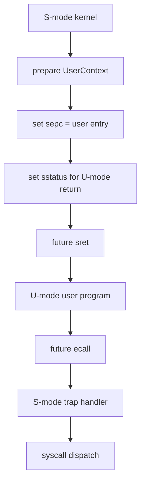

# Lab6：用户态与系统调用

## 实验背景

Lab6 在 Lab5 的内核态协作式调度基础上，引入用户态和系统调用的教学边界。第一版只建立最小 U-mode 上下文、系统调用 ABI 和验收框架，不实现完整 ELF 加载、多进程地址空间或复杂用户指针检查。

`lab6-starter` 只提供骨架和 TODO，能够编译、启动并输出 `[Lab6] TODO`。它不真正执行 `sret` 进入用户态，也不输出 `[Lab6] PASS`。

## 学习目标

- 理解 U-mode 与 S-mode 的权限边界。
- 理解 `sepc`、用户栈、用户入口和 `sstatus` 的关系。
- 理解系统调用号、参数寄存器和返回值约定。
- 理解用户程序如何通过 `ecall` 请求内核服务。
- 能够用 QEMU marker 区分 starter 和 solution。

## 前置实验

- Lab1：启动、SBI 和控制台。
- Lab2：trap 与异常处理。
- Lab3：物理页分配器。
- Lab4：Sv39 虚拟内存。
- Lab5：任务管理与协作式调度。

## 基础必做任务

Lab6 拆成 3 个递进小任务。每个任务都保持中等难度，前一个任务为后一个任务提供基础。

### 任务 1：用户态上下文边界

学习目标：理解内核准备返回用户态前需要保存哪些最小信息。

代码边界：

- `UserContext`
- `UserProgram`
- 用户入口地址
- 用户栈顶地址

需要完成：

- 记录用户程序入口地址。
- 将用户栈顶按 16 字节对齐。
- 将 `sepc` 设置为用户入口。
- 准备 `sstatus`，使未来 `sret` 返回 U-mode。

运行现象：

- 主机单元测试能够验证入口地址、栈顶对齐和用户权限位规划。
- QEMU 中能够看到 `[Lab6] user runtime initialized`。

验收标准：

- Starter 中只构造上下文，不执行真实 `sret`。
- 用户栈、入口和 `sepc` 的关系清晰。
- 不引入动态任务创建或复杂装载器。

### 任务 2：系统调用约定

学习目标：理解用户态和内核态之间需要一个稳定 ABI。

代码边界：

- `SyscallRequest`
- `SyscallError`
- `dispatch`
- 系统调用号常量

第一版规划的系统调用：

| 名称 | 编号 | 作用 |
|---|---:|---|
| `write` | 64 | 未来向控制台输出用户字符串 |
| `exit` | 93 | 未来结束用户程序 |
| `yield` | 124 | 未来主动让出 CPU |

需要完成：

- 约定 `a7` 保存系统调用号。
- 约定 `a0..a5` 保存最多 6 个参数。
- 约定 `a0` 保存返回值。
- 在 starter 中让已规划 syscall 返回 `Unimplemented`，未知 syscall 返回 `UnknownSyscall`。

运行现象：

- 主机单元测试能够验证 syscall 编号和请求结构。
- Starter 不会伪装已经完成系统调用。

验收标准：

- 系统调用号稳定。
- 未实现状态明确。
- 不处理用户指针复制等高级内容。

### 任务 3：最小用户程序验收框架

学习目标：理解用户态实验需要同时验证内核入口、系统调用路径和最终退出。

代码边界：

- `run_lab6`
- `scripts/test-lab6.ps1`
- 未来用户程序 marker

需要完成：

- 在内核启动流程中接入 Lab6 starter。
- QEMU 输出 `[Lab6] start`。
- QEMU 输出 `[Lab6] user runtime initialized`。
- QEMU 输出 `[Lab6] TODO: implement user mode and syscalls`。
- `test-lab6.ps1 -ExpectIncomplete` 确认 starter 未提前输出 `[Lab6] PASS`。

运行现象：

```text
[Lab5] PASS
[Lab6] start
[Lab6] user runtime initialized
[Lab6] TODO: implement user mode and syscalls
```

验收标准：

- Lab1 到 Lab5 回归仍然通过。
- Lab6 starter 能启动并正常退出。
- Lab6 starter 不泄露 solution 成功标志。

## Starter 与 Solution 区别

`lab6-starter`：

- 提供用户态上下文和系统调用 ABI 骨架。
- 提供主机单元测试和 QEMU incomplete 测试。
- 不进入 U-mode。
- 不处理真实 `ecall from U-mode`。
- 不输出 `[Lab6] PASS`。

未来 `lab6-solution`：

- 完成最小用户态进入路径。
- 处理用户态 `ecall`。
- 实现 `write`、`yield`、`exit` 的最小分发。
- 输出用户程序 marker 和 `[Lab6] PASS`。

## 用户态切换规划



## 不允许修改的基础设施

- QEMU 启动参数。
- SBI 控制台和关机接口。
- Lab2 breakpoint demo。
- Lab3 物理页分配器。
- Lab4 恒等映射验收。
- Lab5 协作式调度验收。

## 构建和测试命令

主机单元测试：

```powershell
cargo test -p ai-os-kernel --lib --target x86_64-pc-windows-msvc
```

Lab6 starter 验收：

```powershell
powershell -NoProfile -ExecutionPolicy Bypass -File scripts/test-lab6.ps1 -ExpectIncomplete
```

完整回归：

```powershell
cargo fmt --all -- --check
cargo build -p ai-os-kernel
cargo clippy -p ai-os-kernel -- -D warnings
powershell -NoProfile -ExecutionPolicy Bypass -File scripts/test-lab1.ps1
powershell -NoProfile -ExecutionPolicy Bypass -File scripts/test-lab2.ps1
powershell -NoProfile -ExecutionPolicy Bypass -File scripts/test-lab3.ps1
powershell -NoProfile -ExecutionPolicy Bypass -File scripts/test-lab4.ps1
powershell -NoProfile -ExecutionPolicy Bypass -File scripts/test-lab5.ps1
powershell -NoProfile -ExecutionPolicy Bypass -File scripts/test-lab6.ps1 -ExpectIncomplete
```

## 常见错误

- `sepc` 没有指向用户入口。
- 用户栈没有按 16 字节对齐。
- 把 starter 写成了直接输出 `[Lab6] PASS`。
- 忘记区分 unknown syscall 和 planned-but-unimplemented syscall。
- 在 starter 中过早引入完整 ELF 加载或复杂用户指针检查。

## 调试建议

- 先用主机测试检查 `UserContext` 和 `SyscallRequest`。
- 再用 QEMU 检查 Lab1 到 Lab5 marker 是否仍然存在。
- 如果 Lab6 marker 缺失，先检查 `run_lab6()` 是否在 `run_lab5()` 之后调用。
- 如果未来处理 `ecall` 后反复进入 trap，优先检查 `sepc` 是否推进。

## 扩展任务与思考题

扩展任务不属于基础必做内容：

- 完整 ELF 加载。
- 多用户程序地址空间。
- 用户指针合法性检查。
- 用户态页权限与 page fault 恢复。

思考题：

1. 为什么用户程序不能直接调用内核函数？
2. 为什么系统调用号和寄存器约定必须稳定？
3. 为什么从 U-mode 进入内核后需要检查调用来源？
4. 如果用户传入非法指针，内核应该如何处理？

## 教师验收方法

1. 在 `lab6-starter` 运行 `scripts/test-lab6.ps1 -ExpectIncomplete`。
2. 确认输出包含 `[Lab5] PASS` 和 Lab6 starter marker。
3. 确认输出不包含 `[Lab6] PASS`。
4. 代码审查时确认 starter 只提供用户态/系统调用骨架，没有提前实现完整参考答案。
