# tg-rCore 五个基础实验练习总结报告

> 赛题 30% 基础实验部分独立证据材料
>
> 实验基准：`rcore-os/tg-rcore-tutorial`，`test` 分支
>
> 固定上游提交：`d6330a6db1f81c8c1cfba5ec3db9923199398f24`
> 实验完成提交：`412a27e6fef47103f46f467ca37ef7c1088343f1`

## 摘要

本报告对应赛题技术指标第一项：与 AI 协作完成“最新教学实验环境”中的 5 个基础实验练习，并形成完整练习总结。五个实验分别来自 Chapter 3、4、5、6、8，覆盖系统调用跟踪、虚拟内存、进程与调度、硬链接与文件状态、死锁检测。

实验采用真实 Ubuntu、Rust、RISC-V 交叉编译和 QEMU 测试环境。每章严格经历“未实现基线失败、单章实现与调试、最终测试通过、本地阶段提交”四个阶段。报告中的截图均在对应阶段实时采集；原始 QEMU 日志留在隔离参考仓库，比赛仓库只保存匿名化摘要、补丁、截图和版本清单。

最终结果如下：

| 实验 | 原始练习测试 | 最终基础测试 | 最终练习测试 | 本地提交 |
|---|---:|---:|---:|---|
| Chapter 3 系统调用跟踪 | `5/7` | `4/4` | `7/7` | `dc49689` |
| Chapter 4 虚拟内存 | `9/16` | `6/6` | `16/16` | `420ae4f` |
| Chapter 5 进程与调度 | `4/17` | `14/14` | `17/17` | `3c70482` |
| Chapter 6 硬链接与文件状态 | `4/33` | `15/15` | `33/33` | `a46815a` |
| Chapter 8 死锁检测 | `24/25`，300 秒超时 | `22/22` | `25/25` | `412a27e` |

结论：五个指定基础实验均已完成实际实现与测试，形成了可由提交、补丁、日志摘要和三阶段截图交叉核验的证据链。

## 1. 赛题要求与完成映射

赛题要求不是只阅读教材或运行现成答案，而是要求完成五个基础练习、提升操作系统理论与实践能力，并提交练习总结报告。本材料对要求的映射如下：

| 赛题要求 | 本次交付 |
|---|---|
| 完成 5 个基础实验练习 | 完成 Chapter 3、4、5、6、8 的 exercise 任务 |
| 与 AI 协作 | 每章记录提示目标、建议、采用决定、失败修复和验证结果 |
| 操作系统理论与实践 | 涵盖 syscall、Sv39、进程、调度、文件系统、同步与死锁 |
| 完成练习总结报告 | 本 Markdown；同名 PDF 在完成后自评确认后导出 |
| 过程与结果可证明 | 每章包含基线失败、实现差异、最终通过三类真实截图 |

## 2. 实验方法与证据架构

### 2.1 双仓隔离

参考实验与比赛自研项目不混放：


- Ubuntu 参考仓库只负责真实代码、构建、QEMU 和阶段提交。
- 比赛仓库报告分支只收纳总结材料，不引入参考项目的 23 个 Crate。
- 原比赛工作区的未提交内容未被切换、覆盖或清理。
- 全过程没有执行 `git push`，没有修改 `main`。

### 2.2 环境

| 项目 | 实际版本或状态 |
|---|---|
| Ubuntu | 20.04，x86_64 |
| Git | 2.25.1 |
| Rust / Cargo | 1.97.1 |
| RISC-V target | `riscv64gc-unknown-none-elf` |
| QEMU | 8.2.10 |
| 测试器 | `tg-rcore-tutorial-checker 0.4.8` |
| OpenSBI | 参考仓库未安装；本实验 QEMU 命令使用 `-bios none` |

完整匿名化环境记录见 [logs/environment.txt](logs/environment.txt)，环境截图见下图。

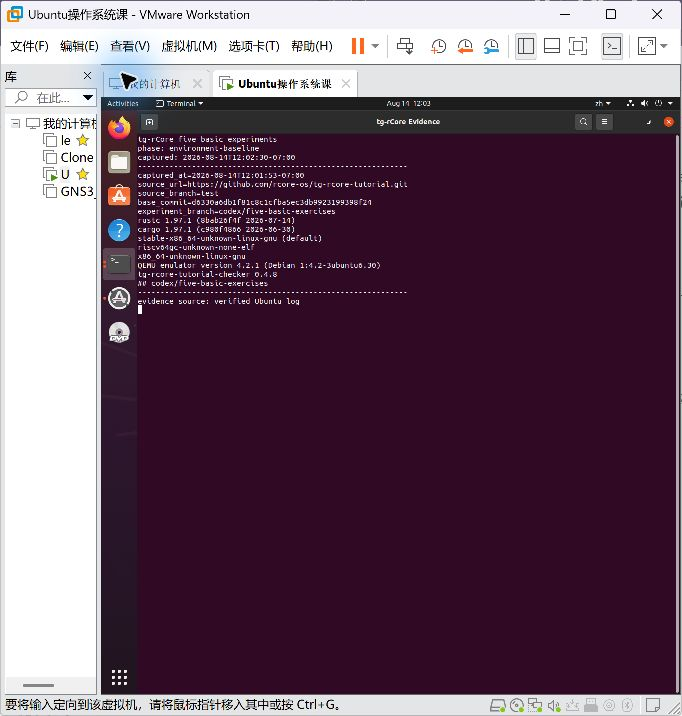

### 2.3 证据规则

每章至少保留三类截图：

1. `01-baseline-failure.png`：未实现状态下的实际失败。
2. `02-implementation-diff.png`：真实工作区状态和实现差异摘要。
3. `03-final-pass.png`：实际构建、基础测试和练习测试结果。

截图前显示时间、上游提交、实验分支、当前提交、工作区状态和命令。终端证据使用匿名标题，不在报告中保存登录用户名、密码、密钥或绝对路径。

## 3. Chapter 3：系统调用跟踪

### 3.1 任务与知识点

实现 `sys_trace(410)`：

- `trace_request=0`：从当前任务地址读取一个 `u8`。
- `trace_request=1`：向当前任务地址写入 `data` 的最低字节。
- `trace_request=2`：查询当前任务指定系统调用的累计次数，本次 `trace` 也计数。
- 非法请求和越界系统调用编号返回 `-1`。

核心知识包括系统调用分发、任务控制块、用户寄存器参数、每任务状态隔离和内核栈布局。

### 3.2 原始失败

原始上游代码中的 `trace` 是占位实现。执行 `./test.sh exercise` 只通过 `5/7`，日志明确出现 `trace: not implemented`。

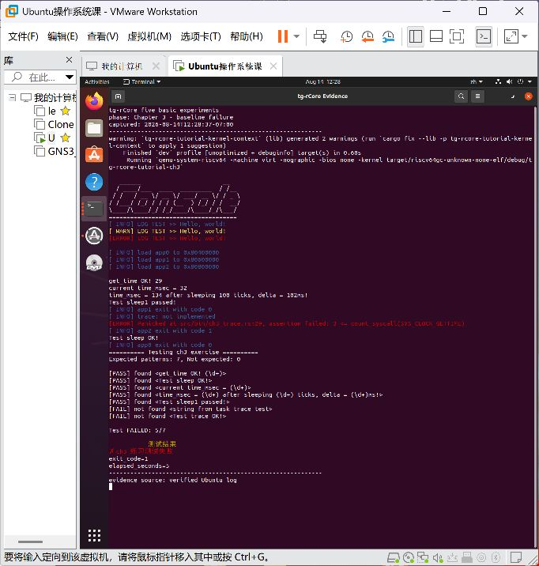

对应摘要：[logs/ch3-baseline.txt](logs/ch3-baseline.txt)

### 3.3 AI 协作与实现

AI 协作目标是找到“计数应该属于任务还是全局”的正确边界。最终采用每个 `TaskControlBlock` 独立维护计数表，系统调用进入分发器时先计数，再调用具体处理函数。`Caller.entity` 只在同步分发期间携带当前任务计数表地址。

关键实现：

- 新增 `SYSCALL_COUNT_LIMIT=500` 和每任务计数表。
- 任务复用时清零计数，避免前一个应用的历史泄漏给后一个应用。
- 本章尚未引入地址空间隔离，按题设使用当前任务给出的地址访问字节。
- 扩大内核栈，容纳变大的任务控制块数组。

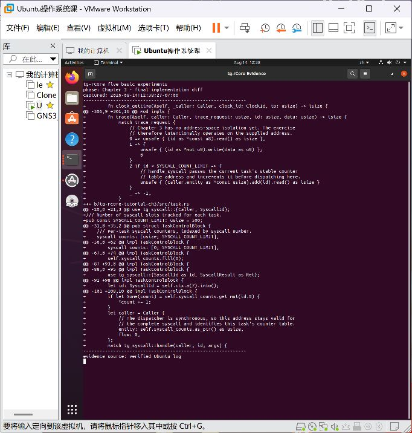

实现摘要：[logs/ch3-implementation.txt](logs/ch3-implementation.txt)；完整补丁：[patches/ch3-trace-exercise.patch](patches/ch3-trace-exercise.patch)

### 3.4 失败与修复

首次构建暴露常量作用域、未使用导入和类型推断错误；修复后第一次基础测试仍只有 `1/4`。结合任务结构变化检查栈布局后，确认大型计数表增大了栈上 TCB 数组，扩大内核栈后恢复所有写入测试。

这一步的学习重点是：功能代码正确不等于系统布局仍然安全，内核中的结构体尺寸变化会直接影响静态数组和栈空间。

### 3.5 最终验证

```text
cargo build --features exercise      exit 0
./test.sh base                       4/4
./test.sh exercise                   7/7
cargo clippy --features exercise     exit 0
```

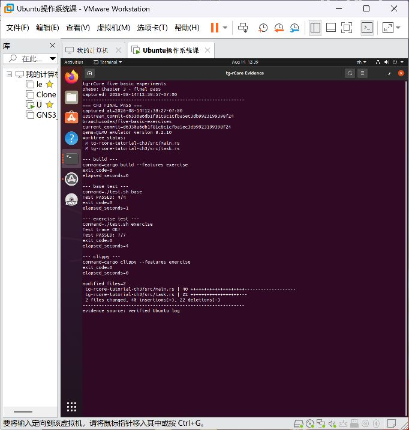

结果摘要：[logs/ch3-final.txt](logs/ch3-final.txt)

### 3.6 学习收获

系统调用计数看似只是数组加一，实际涉及任务身份、分发时机、生命周期清零和内核内存布局。通过本章明确了“状态属于谁”是内核设计中的首要问题，也理解了系统调用入口比单个 syscall 实现更适合承担统一计数职责。

## 4. Chapter 4：虚拟内存

### 4.1 任务与知识点

本章需要在 Sv39 虚拟内存启用后重写 `trace`，并实现匿名 `mmap(222)`、`munmap(215)`。重点是用户地址翻译、PTE 权限、页对齐、区间溢出、映射重叠和失败回滚。

### 4.2 原始失败

原始状态中 `trace` 和 `mmap` 都是占位实现，练习测试只有 `9/16`。

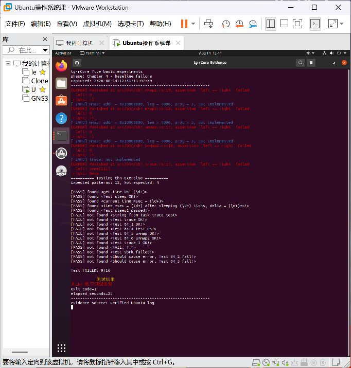

对应摘要：[logs/ch4-baseline.txt](logs/ch4-baseline.txt)

### 4.3 AI 协作与实现

协作重点是把题目中的 Linux 风格参数转换成教学内核实际支持的页表操作。最终实现遵循“先验证、后修改”的顺序：

- `trace` 使用 `AddressSpace::translate`，分别要求用户可读或用户可写。
- `mmap` 检查页对齐、非零长度、权限位、地址加法溢出和区间重叠。
- 长度按页向上取整；映射中途失败时回滚已经建立的页。
- `munmap` 先确认整个区间已映射，再统一解除，避免只拆除半段。
- 系统调用计数表迁移到 `Box<[usize]>`，减少任务结构在栈上的占用。

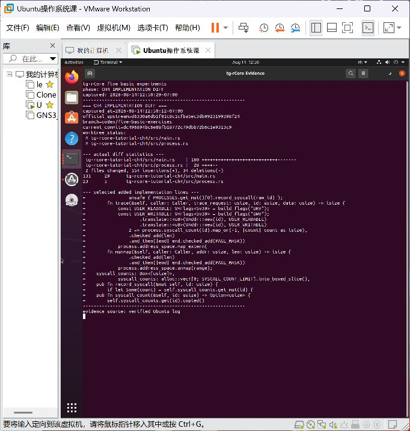

实现摘要：[logs/ch4-implementation.txt](logs/ch4-implementation.txt)；完整补丁：[patches/ch4-virtual-memory.patch](patches/ch4-virtual-memory.patch)

### 4.4 失败与修复

初版继续把 500 项计数表放在进程结构的栈驻留部分，基础测试退化为 `2/6`，写测试与 `sbrk` 结果缺失。将计数表改为堆分配后，地址空间和进程结构尺寸恢复到可接受范围。

这次修复建立了一个重要认识：虚拟内存实验不仅是 PTE 位运算，还必须同时关注内核自身的数据结构放在哪里、占多少空间。

### 4.5 最终验证

```text
cargo fmt --manifest-path tg-rcore-tutorial-ch4/Cargo.toml  exit 0
cargo build --features exercise                              exit 0
./test.sh base                                               6/6
./test.sh exercise                                           16/16
cargo clippy --features exercise                             exit 0
```


结果摘要：[logs/ch4-final.txt](logs/ch4-final.txt)

### 4.6 学习收获

本章把“虚拟地址只是一个数字”的直觉改成了“虚拟地址必须连同页表、权限和所属地址空间一起解释”。尤其是先完整验证 `munmap` 区间再修改页表，体现了系统调用失败时应尽量保持原状态的事务性思想。

## 5. Chapter 5：进程与 Stride 调度

### 5.1 任务与知识点

本章迁移上一章的 `mmap/munmap`，新增：

- `spawn(400)`：直接从内置 ELF 创建子进程并建立父子关系。
- `set_priority(140)`：设置合法优先级。
- Stride 调度：选择 stride 最小的 runnable 进程，运行后增加 `BIG_STRIDE / priority`。

知识点包括 ELF 装载、进程创建语义、父子关系、调度公平性、整数回绕和前向兼容。

### 5.2 原始失败

原始代码反复输出 `spawn: not implemented`，练习测试只有 `4/17`。

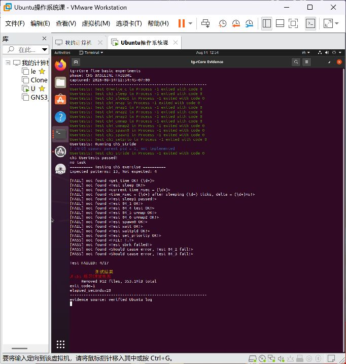

对应摘要：[logs/ch5-baseline.txt](logs/ch5-baseline.txt)

### 5.3 AI 协作与实现

协作中先区分了 `spawn` 与 `fork`：题目不要求复制父地址空间，因此直接读取内置 ELF 并调用进程构造路径更符合语义。调度部分采用教学上更清楚的线性扫描，不为小规模测例引入额外优先队列。

最终参数：

- 默认优先级：`16`。
- 最低合法优先级：`2`。
- `BIG_STRIDE`：`65536`。
- 初始 stride：`0`。
- 比较方式：使用回绕安全的有符号差值判断。

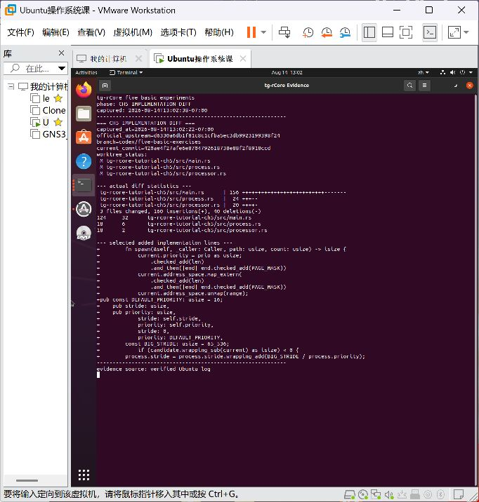

实现摘要：[logs/ch5-implementation.txt](logs/ch5-implementation.txt)；完整补丁：[patches/ch5-process-stride.patch](patches/ch5-process-stride.patch)

### 5.4 失败与修复

功能测试通过前，Clippy 报告了冗余 `as_bytes`、文档列表缩进、冗余 `return` 和手写赋值运算。逐项修复并重跑后退出码为 `0`。调度测试还输出不同优先级的运行计数，比例约为统一常数乘以优先级，证明实现不是只返回固定结果。

### 5.5 最终验证

```text
cargo build --features exercise      exit 0
./test.sh base                       14/14
./test.sh exercise                   17/17
cargo clippy --features exercise     exit 0
```

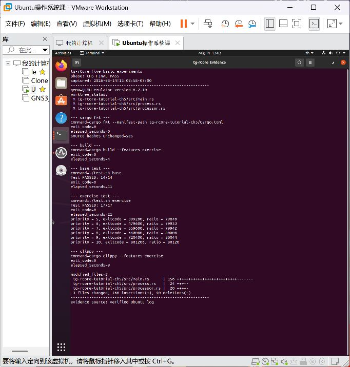

结果摘要：[logs/ch5-final.txt](logs/ch5-final.txt)

### 5.6 学习收获

Stride 调度把“优先级”从抽象数字变成了可观察的 CPU 时间比例。实现中最容易忽略的是 stride 会回绕；只用普通无符号 `<` 比较可能在长时间运行后选错进程。`spawn` 则帮助区分了“复制现有进程”和“从程序映像创建进程”两条不同路径。

## 6. Chapter 6：硬链接与文件状态

### 6.1 任务与知识点

实现 `linkat(37)`、`unlinkat(35)`、`fstat(80)`，并扩展 easy-fs 支持持久化硬链接语义。任务的关键不在三个系统调用外壳，而在 inode 身份、目录项、链接计数和最终资源回收的一致性。

### 6.2 原始失败

原始练习测试只有 `4/33`，链接和文件状态相关证据缺失。

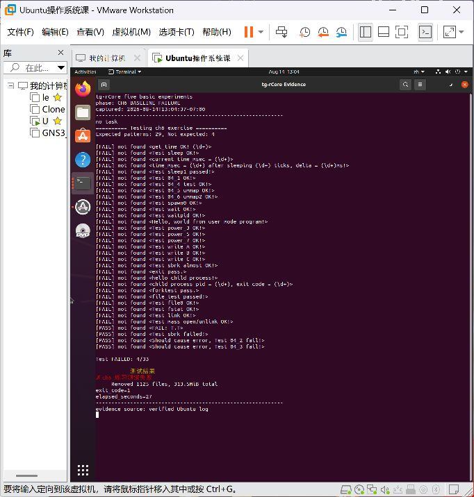

对应摘要：[logs/ch6-baseline.txt](logs/ch6-baseline.txt)

### 6.3 AI 协作与实现

AI 建议先从 easy-fs 的持久化结构入手，而不是在系统调用层维护临时计数。采用后形成以下语义：

- `DiskInode` 持久化 `nlink`，并提供稳定 inode 编号。
- 新硬链接只增加目录项和链接计数，不复制文件数据。
- 删除目录项时减少链接计数；最后一个链接消失后回收数据块和 inode 位图。
- 目录中的空槽可复用，避免反复 link/unlink 无限增长。
- `fstat` 返回 inode 编号、模式、链接数等信息。
- 用户路径逐字节安全读取；`Stat` 逐字节写回，以覆盖跨页缓冲区。
- 迁移 Chapter 4、5 功能，满足本章前向兼容测试。


实现摘要：[logs/ch6-implementation.txt](logs/ch6-implementation.txt)；完整补丁：[patches/ch6-hard-link-exercises.patch](patches/ch6-hard-link-exercises.patch)

### 6.4 失败与修复

本章按“磁盘格式与 inode API、目录操作、系统调用、迁移回归”顺序推进。这样可以用共享 inode 和数据的客观行为验证链接，而不是只让单个测试字符串出现。Clippy 已实际执行，但 Rust 1.97 在上游 `build.rs` 和既有代码中触发严格 lint；为保持实验范围，没有修改无关上游模块。

### 6.5 最终验证

```text
cargo build --features exercise      exit 0，8 秒
./test.sh base                       15/15，25 秒
./test.sh exercise                   33/33，53 秒
cargo clippy --features exercise     已执行，上游既有 lint 阻断
```

练习结果包含 `file0`、`fstat`、`link` 和大量 open/unlink 场景。

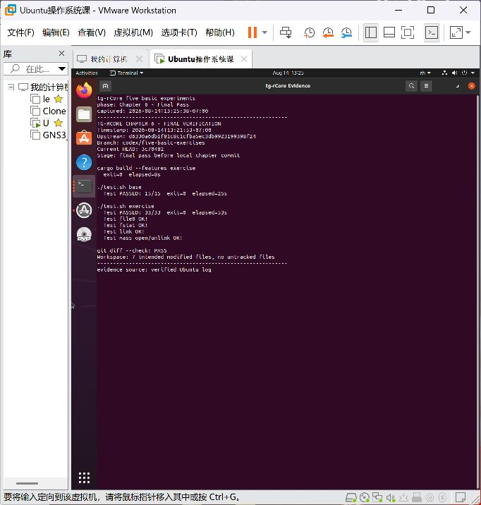

结果摘要：[logs/ch6-final.txt](logs/ch6-final.txt)

### 6.6 学习收获

硬链接证明“文件名不是文件本身”：目录项保存名字到 inode 的映射，多个名字可以共享同一个 inode 和数据。真正决定资源能否回收的是链接计数，而不是某个文件描述符是否关闭。文件系统功能必须同时维护内存状态和磁盘持久化状态。

## 7. Chapter 8：死锁检测

### 7.1 任务与知识点

实现 `enable_deadlock_detect(469)`：

- 只接受 `0/1`，控制当前进程是否启用检测。
- 对 mutex 和 semaphore 分别维护 `Available / Allocation / Request`。
- `mutex_lock` 或 `semaphore_down` 导致不安全状态时返回 `-0xDEAD`。
- 安全但资源暂不可用时仍正常阻塞。
- 不要求检测 mutex、semaphore、`waittid` 的混合死锁。

### 7.2 原始失败

原始 detector 未实现。练习测试在 300 秒后超时，`24/25`，唯一缺失的是 mutex 自锁检测成功标志。

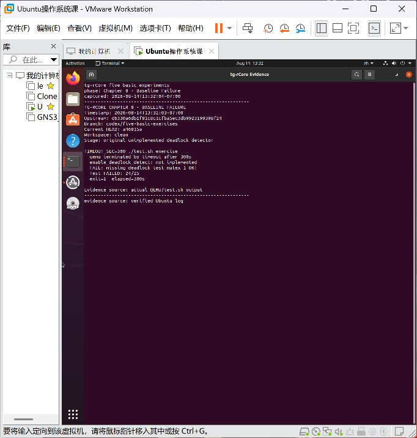

对应摘要：[logs/ch8-baseline.txt](logs/ch8-baseline.txt)

### 7.3 AI 协作与实现

协作重点是检测器与底层等待队列的一致性。仅在 syscall 入口做判断并不够，因为 unlock/up 会把资源直接转交给等待线程。最终为每个进程、每类同步资源建立 `ResourceTracker`：

1. 申请可用资源时先暂时减少 `Available`、增加 `Allocation`。
2. 资源不可用时增加当前线程的 `Request`。
3. 启用检测时运行安全性算法；不安全则回滚暂存变化并返回 `-0xDEAD`。
4. 安全且不可用则进入底层等待队列，系统调用返回阻塞标志。
5. unlock/up 唤醒线程时，减少释放者分配，清除等待者请求，并把所有权转给等待者。

安全性算法从 `Work=Available` 开始，反复寻找 `Request <= Work` 的未完成线程，并把其 `Allocation` 归还到 `Work`。全部线程可完成才判为安全。

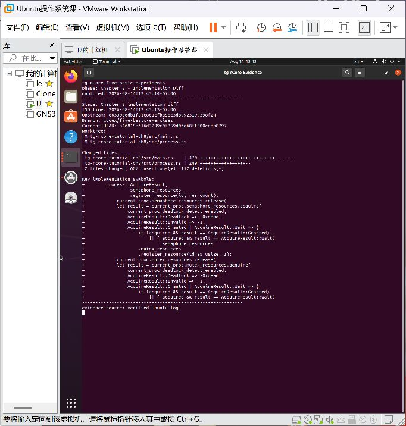

实现摘要：[logs/ch8-implementation.txt](logs/ch8-implementation.txt)；完整补丁：[patches/ch8-deadlock-detection-exercise.patch](patches/ch8-deadlock-detection-exercise.patch)

### 7.4 失败与修复

第一次编译发现 `mutex_create` 重构时漏写 `let id =`，并触发 Rust 1.97 对未使用 `#[macro_use]` 的严格错误。最小修复后重新构建通过。

练习测试验证了三类关键边界：

- 同一线程重复获取同一 mutex：拒绝，返回 `-0xDEAD`。
- 三线程形成 semaphore 循环等待：至少一个请求被拒绝，系统继续完成。
- 存在可完成序列的 semaphore 分配：不误报。

### 7.5 最终验证

```text
cargo build --features exercise             exit 0，3.554 秒
TIMEOUT_SEC=300 ./test.sh base               22/22
TIMEOUT_SEC=300 ./test.sh exercise           25/25
TIMEOUT_SEC=300 ./test.sh all                exit 0，2 分 18.820 秒
cargo clippy --features exercise             已执行，上游既有 lint 阻断
```


结果摘要：[logs/ch8-final.txt](logs/ch8-final.txt)

### 7.6 学习收获

死锁检测不是看到“资源为零”就拒绝，而是判断当前状态是否仍存在所有线程都能完成的顺序。安全但暂时不可用的请求应阻塞，不安全请求才拒绝。实现还说明资源计数、等待队列和调度状态必须共同变化，否则检测器会与真实锁状态脱节。

## 8. 五章递进关系

五个练习并非孤立功能：

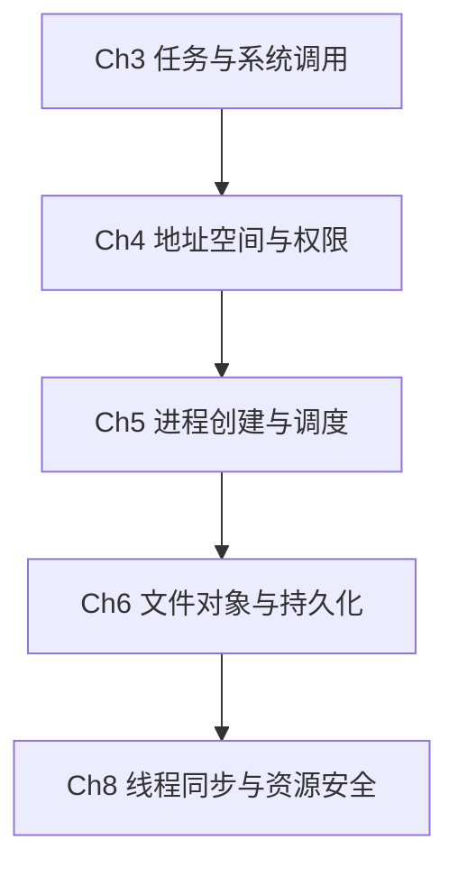

- Chapter 3 建立任务级系统调用状态。
- Chapter 4 引入地址空间隔离，迫使内核验证用户地址。
- Chapter 5 把单任务机制扩展到进程生命周期和公平调度。
- Chapter 6 把系统调用连接到持久化对象与共享身份。
- Chapter 8 在多线程资源竞争中维护全局安全状态。

这种顺序使学习从“一个调用如何进入内核”逐步发展到“多个线程和多个持久化对象如何保持一致”。

## 9. 既有 xv6 学习基础

在本次 rCore 实验前，已有 MIT xv6 平台的课程实验记录。原始 `.doc` 含个人信息，因此没有提交；这里只从实验过程页选取三张匿名化裁切图，证明已有页表、并发同步和 mmap 学习基础。

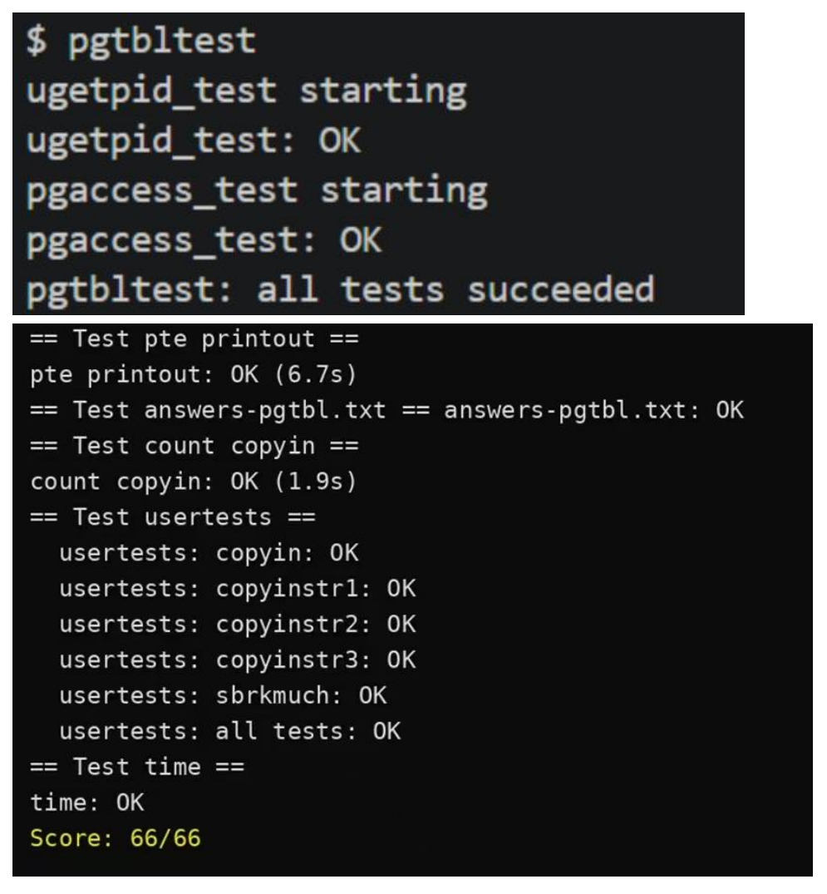

图 1：xv6 页表实验中的 `pgtbltest`、`usertests` 和评分结果。

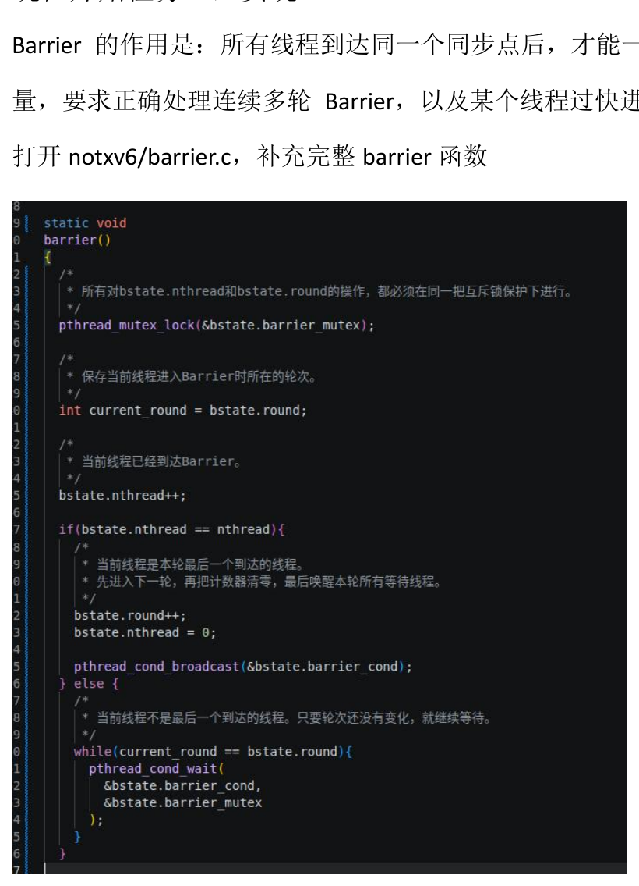

图 2：xv6 多线程实验中 Barrier 的互斥锁与条件变量实现记录。

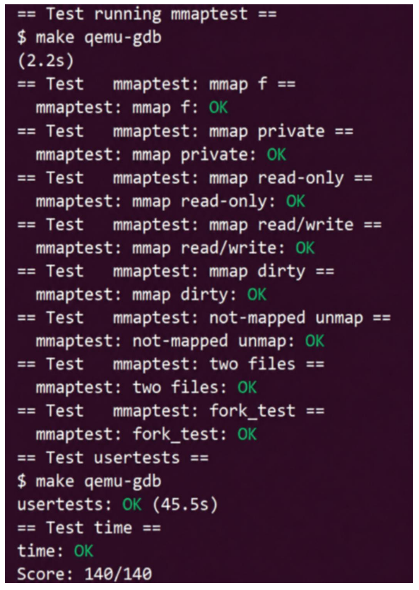

图 3：xv6 mmap 实验的多场景测试结果。

这些历史分数只说明对应平台的测试完成情况，不能与本次 tg-rCore 测例数量或比赛得分直接换算。两类环境的语言、内核结构、任务边界和测试器不同。

## 10. AI 协作评价

### 10.1 可核验作用

AI 在本次实验中的有效作用主要有：

- 从任务文档、trait 实现和测试程序中定位真实接口。
- 将题目要求拆成数据归属、状态转换、失败回滚和边界检查。
- 根据编译器与测试日志定位栈布局、借用、类型和严格 lint 问题。
- 用补丁、提交和哈希固定每章改动。
- 组织匿名化证据与总结报告。

详细记录见 [ai/collaboration-log.md](ai/collaboration-log.md)。

### 10.2 人工判断责任

AI 建议没有直接当作实验结论。是否采用某个方案取决于：

- 是否符合 `exercise.md` 的接口与返回值。
- 是否保持章节既有同步、进程和地址空间语义。
- 是否通过基础测试和练习测试。
- 是否引入超出实验范围的改动。
- 是否能在补丁和日志中复核。

### 10.3 前后自评

实验前基线自评：

| 能力 | 实验前 |
|---|---:|
| 操作系统理论 | `3/5` |
| Rust / RISC-V 实现 | `3/5` |
| QEMU、测试与 AI 调试 | `1/5` |

实验后自评将在使用者确认同一量表的三项分数后写入最终 PDF；在确认前不代替学习者虚构主观分数。

## 11. 局限与异常记录

- Chapter 6、8 的功能测试全部通过，但当前 Rust 1.97 Clippy 被上游既有严格 lint 阻断；报告不把它写成通过。
- 虚拟机 QEMU 串口在部分长测试中出现字符重复显示，checker 仍从完整输出识别稳定标志；最终摘要使用测试器的结构化 PASS 结果。
- Chapter 8 的原始失败需要等待 300 秒超时，这是底层 mutex 自锁真实阻塞造成的基线行为。
- 参考 QEMU 命令使用 `-bios none`，因此参考环境没有安装 OpenSBI；这与比赛自研内核的 QEMU/OpenSBI 路线分开记录。
- 所有提交均为本地实验提交，没有推送到官方仓库或比赛远端。

## 12. 版本、补丁与复现

### 12.1 提交链

| 顺序 | 提交 | 内容 |
|---:|---|---|
| 0 | `d6330a6` | 官方固定上游 |
| 1 | `dc49689` | Chapter 3 trace |
| 2 | `420ae4f` | Chapter 4 virtual memory |
| 3 | `3c70482` | Chapter 5 process and stride |
| 4 | `a46815a` | Chapter 6 hard links |
| 5 | `412a27e` | Chapter 8 deadlock detection |

最终参考分支工作区为 clean。五份补丁可按顺序应用到固定上游；文件 SHA-256、截图、日志和提交映射见 [manifest.json](manifest.json)。

### 12.2 复现命令模板

进入对应章节目录后：

```bash
source "$HOME/.cargo/env"
export PATH="$HOME/.local/qemu-8.2.10/bin:$PATH"
cargo build --features exercise
./test.sh base
./test.sh exercise
```

Chapter 8 最终全量命令：

```bash
TIMEOUT_SEC=300 ./test.sh all
```

## 13. 总结

本次工作完成了赛题 30% 部分指定的五个基础实验，并且不是只保留最终成功画面。每章都有固定上游、真实失败、代码差异、修复过程、最终通过、补丁、哈希和本地提交。

五章学习把操作系统知识从任务级系统调用推进到虚拟地址安全、进程调度、持久化文件对象和并发资源安全。AI 提高了接口检索、调试和证据组织效率，但所有“完成”结论最终由实际 Rust 构建、QEMU 运行和测试器结果给出。

## 参考资料

- [tg-rCore Tutorial `test` 分支](https://github.com/rcore-os/tg-rcore-tutorial/tree/test)
- [rCore Tutorial Book v3](https://rcore-os.cn/rCore-Tutorial-Book-v3/)
- [rCore Tutorial Guide](https://learningos.github.io/rCore-Tutorial-Guide/)
- [LearningOS rCore Tutorial Test](https://github.com/LearningOS/rCore-Tutorial-Test/)
- [MIT xv6-riscv](https://github.com/mit-pdos/xv6-riscv)
- [OSTEP 中文版](https://pages.cs.wisc.edu/~remzi/OSTEP/Chinese/)
- [CSAPP 中文参考](https://hansimov.gitbook.io/csapp/)

---

证据索引、文件哈希和最终自评状态以 `manifest.json` 为准。
