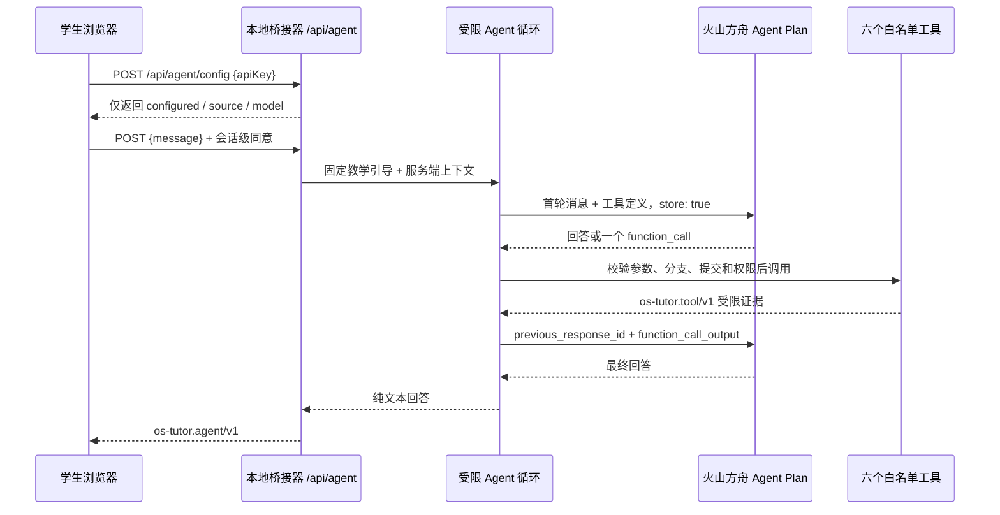

# AI 教学助教与数据边界

本文是教学智能体、远程反馈和本地评分的数据口径基线。页面、实验文档、答辩材料与验收报告均应以这里的边界为准，不能再笼统描述为“完全本地”或“统一上传”。

## 教学定位

AI 教学助教位于可视化页面的“本地规则诊断”之后。它面向学生提供引导式、证据化解释：先观察当前分支和运行证据，再解释机制、定位教学代码、预测结果，最后建议验证。回答不是标准答案、确定的根因结论或评分依据，每次提问独立处理。

本地规则诊断与教学智能体是两套独立能力：前者由确定性规则在浏览器和本地桥接器中运行，不调用模型；后者只有在学生明确同意并手动提问后才访问云端模型。

## 架构与协议



公共接口保持稳定：

- `POST /api/agent` 只接受 `{ "message": string }`，最大 4000 字符。
- 响应协议为 `os-tutor.agent/v1`，工具结果协议为 `os-tutor.tool/v1`。
- `GET /api/agent/config` 与 `/api/context` 只返回模型是否已配置、凭据来源、提供方、模型名、协议版本和 `remoteStore`，绝不返回 API Key、请求头、密钥长度或指纹。
- `POST /api/agent/config` 只接受本地同源页面提交的 `{ "apiKey": string }`，`DELETE /api/agent/config` 只清除页面设置的进程内 Key；两者拒绝浏览器自带的 `Authorization` 和非本地 Origin。
- 默认提供方为火山方舟 Agent Plan，模型为 `ark-code-latest`。
- 首轮发送服务端教学引导和六个工具定义；续轮使用 `previous_response_id` 与匹配的 `function_call_output`，并按方舟协议重新发送不会由上一响应继承的服务端教学引导。
- 循环最多 4 个模型轮次、3 次工具调用，总时限 90 秒；模型单次请求时限 45 秒。

## 六个白名单工具

| 工具 | 允许能力 | 主要限制 |
|---|---|---|
| `get_context` | 当前分支、提交、Lab、角色、工作区计数和任务状态 | 不返回文件名列表、环境变量或密钥 |
| `read_code` | 读取教学范围内的少量源码行 | 拒绝任意路径、答案文件、教师文件、二进制和超限内容 |
| `get_qemu_events` | 读取当前或最近一次运行的结构化事件 | 最多返回 100 条，不返回完整串口日志 |
| `get_run_result` | 读取构建、QEMU、PASS/TODO 和本地诊断摘要 | 不返回完整日志、路径或评分数据 |
| `get_code_diff` | 比较当前教学代码与固定 starter 基线 | 只读、限制路径/文件数/字节数，隐藏敏感路径和凭据 |
| `run_test` | 启动登记表中的 Lab1–Lab7 starter/solution 测试 | 不接受命令字符串；P0、自定义分支、教师工具和任意测试均不支持 |

交互运行和智能体 `run_test` 共用一个任务锁，同一时间只允许一个构建或 QEMU 任务。分支或提交在请求期间发生变化时，旧请求以 `context_changed` 结束，回答被丢弃。

## 首次同意与云端数据

首次提问前，页面明确告知以下事实并要求勾选同意：

- 学生问题及模型按需调用工具得到的受限源码片段、代码差异、QEMU 结构化事件或运行结果可能发送到火山方舟。
- `store: true` 用于以 `previous_response_id` 续接工具调用；云端保留行为由方舟服务和账号配置决定。
- API Key 只存在于本地桥接器进程：可以来自启动时的 `ARK_API_KEY`，也可以由同源助教页激活到当前进程内存；页面输入值不进入 Web Storage 或文件。
- 系统不会发送 API Key、完整终端日志、环境变量、任意文件、教师答案文件或评分记录。
- 同意只记录在当前浏览器会话的 `sessionStorage`，键名为 `os-teaching-agent-consent-v1`。

## 四层数据边界

| 功能 | 数据位置与行为 |
|---|---|
| 确定性诊断、预测、回放、分支比较 | 浏览器与本地桥接器处理，不调用模型 |
| 教学反馈与运行记录提交 | 使用者主动预览并同意后，发送到负责人配置的服务；接收端写入本机 JSONL |
| AI 教学助教 | 问题和模型主动调用工具取得的受限证据发送到火山方舟；密钥仅在本地 Node 进程中 |
| 教师评分 | 本地页面管理，不自动上传成绩，不因智能体回答或运行证据自动加分 |

## 配置、启动与关闭

推荐先不设置 Key，直接启动 bridge：

```bash
node docs/interactive-demo/server.js --port 8888
```

打开 <http://127.0.0.1:8888/agent.html>，在“模型服务”区域输入临时测试 Key 并点击“激活本地模型”。输入成功后字段立即清空；点击“清除本次 Key”或按 `Ctrl+C` 停止服务后，进程内 Key 消失。环境变量方式仍可用于固定的本机测试终端。

Windows PowerShell 环境变量方式：

```powershell
$env:ARK_API_KEY = "在当前终端安全设置的方舟密钥"
powershell -NoProfile -ExecutionPolicy Bypass -File scripts/run-interactive-demo.ps1 -ServeOnly
```

Ubuntu/Linux 环境变量方式：

```bash
export ARK_API_KEY='在当前 shell 安全设置的方舟密钥'
sh scripts/run-interactive-demo.sh
```

不要把密钥写入仓库、命令历史、截图或日志。关闭桥接器进程即可停止教学智能体入口并清空页面激活的 Key；未配置模型时，页面仍可完整使用本地预测、运行、规则诊断、回放和分支比较，独立助教页会锁定发送按钮并提示先激活模型。

网页教学助教与终端 Agent 不是同一运行时。终端工具可能包含 shell、MCP、网络或任意仓库读取；网页只允许本文件列出的六个白名单工具，因此回答不要求逐字一致，也不能在网页中请求未登记的终端工具。验收应检查网页是否真实取得受限仓库证据，以及失败时是否返回固定安全错误码。

## 验收边界

离线自动测试覆盖输入协议、工具策略、上下文变化、任务锁、错误净化、前端同意、长度边界和纯文本渲染。在线验收必须使用具有 Agent Plan 权限的真实密钥，分别验证直接回答、工具调用、受限源码读取、禁止路径、批准测试和上下文变化。未实际完成在线验收时，文档与 PPT 必须标记为“未运行”，不能写成已通过。
